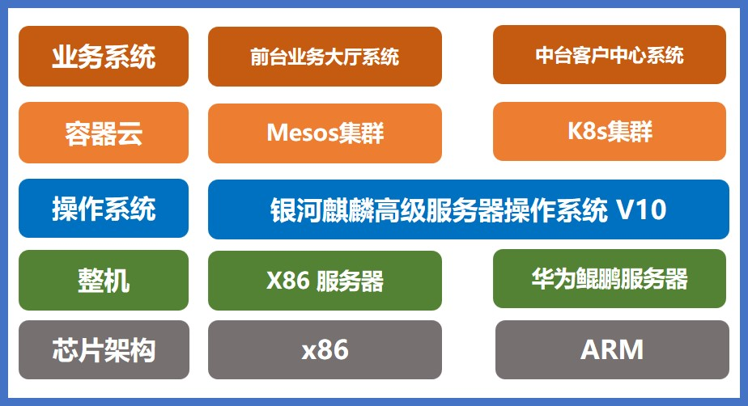

## 应用场景

作为我国省级移动公司的领先者，浙江移动的业务体量、业务复杂度均在国内名列前茅，因此对支撑系统提出了极为严苛的要求，如何完成业务系统无感知的迁移成为用户最关心的需求。浙江移动在 2021 年 8 月完成客户中心、业务大厅等核心系统的适配测试工作，顺利平滑的完成了操作系统迁移，在电信行业内首次完成基于银河麒麟高级服务器操作系统 V10 在运营商核心系统投产。

## 解决方案

- **服务器：** 使用 x86 服务器和华为鲲鹏服务器；
- **操作系统：** 银河麒麟高级服务器操作系统 V10；
- **容器云：** 选择了 Mesos 集群和 K8S 集群；
- **业务系统：** 前台业务大厅系统和中台客户中心系统；
- **IT 架构：** 微服务化、容器化、双平面统一运行、业务统一发布。

## 客户价值

- **稳定运行：** 本次迁移工作完成后，正值一年一度的校园营销活动正式展开。经过一个星期的跟踪，迁移后的系统运行稳定，验证了银河麒麟高级服务器操作系统 V10 能够满足运营商核心系统使用要求；
- **核心系统迁移：** 在电信行业内首次完成基于银河麒麟操作系统在运营商核心系统的迁移投产；
- **规模化推广：** 验证了银河麒麟高级服务器操作系统 V10 可以在运营商核心场景下稳定运行，并可以快速实现规模化推广，同时为浙江移动推广银河麒麟高级服务器操作系统 V10 积累了宝贵经验。

## 伙伴

