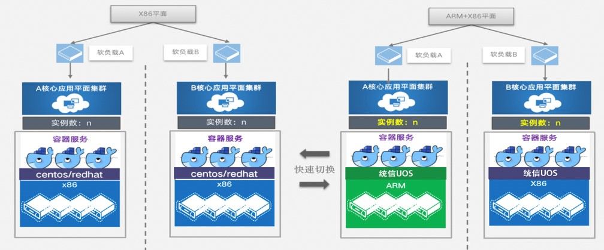

## 应用场景

整体方案主要涉及业务大厅与客户中心等业务系统与国产操作系统、mesos 与 k8s 容器集群、国产芯片服务器的联调适配，基于国产芯片服务器与操作系统构建自主可控集群，并通过标签约束隔离技术，将业务系统到指定自主可控集群。实现了业务代码不变的前提下，完成由芯片到操作系统的国产化替换工作，本次适配成果保证了后续同类架构替换可以实现零改造、规模化推广。

## 解决方案

## 客户价值

- 2021 年 8 月，浙江移动顺利完成业务大厅与客户中心等业务系统与统信服务器操作系统 V20、mesos 与 k8s 容器集群、（具体服务器品牌及型号）服务器的联调适配，原有操作系统全面替换统信服务器操作系统 V20，验证了自主可控服务器操作系统可以在电信运营商最核心交易系统上稳定运行，这是通信行业首家采用全自主可控技术的核心业务系统，标志着运营商 IT 系统完成了核心业务系统在国产操作系统系统上运行的自主可控的能力储备。

- 实现了业务代码不变的前提下，完成由芯片到操作系统的平滑迁移工作。

- 本次适配成果保证了后续同类架构迁移可以实现零改造、规模化推广。

## 伙伴

