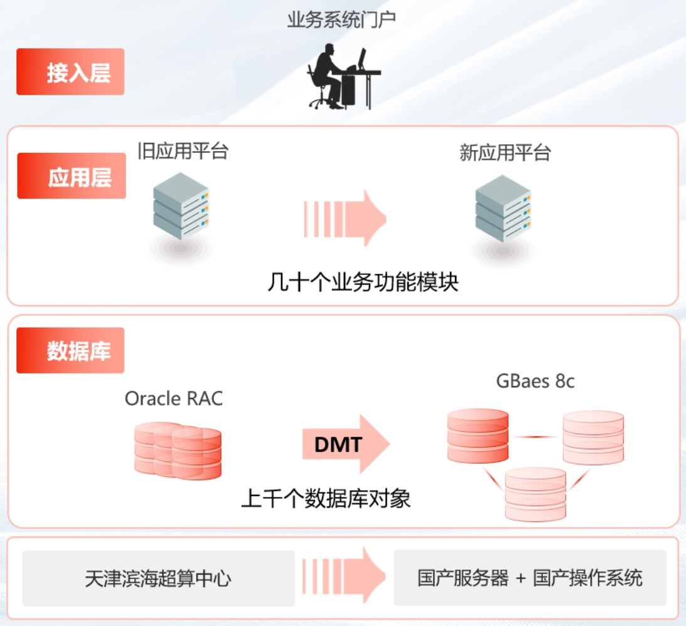

## 客户挑战

随着国务院有关基础软硬件国产化替换工作的决策部署，客户经过多方调研考察后决定，决定将业务核心系统从租用的超算中心，迁移到自建机房，并替换到原使用的Oracle RAC集群，稳步推进基础软硬件产品的国产化替换进程。要求国产数据库系统具备完善的功能以及良好的性能，实现对原有数据库系统的完全替换。

## 解决方案

GBase 8c通过分布式集群的弹性伸缩的能力，帮助用户灵活的应对峰值的业务访问量

## 客户收益

• 异构数据库平滑迁移能力：原Oracle数据库上千个数据库对象，包括几百个复杂对象，利用GBase DMT平滑迁移，保证源库对象和数据平滑迁移，对原业务无影响。

• 弹性伸缩能力：灵活适应客户业务场景需求，实现在线扩缩容能力，并在扩缩容过程中，保证业务持续服务能力。

• 国产化能力：完全兼容国产服务器和操作系统，并且可以在国产环境上达到甚至超过原来国外系统的性能和稳定性能力。

## 合作伙伴

    

