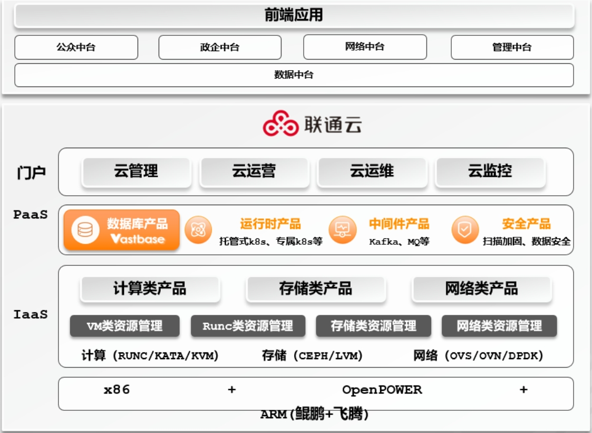

## 应用场景

• 中国联合网络通信有限公司软件研究院（简称“中国联通软件研究院”）是中国联通集团总部提升自主研发能力的重要战略规划，主要承担中国联通集团的内部业务支撑系统、管理支撑系统、大数据、互联网软件研发任务，以及前瞻性技术研究与应用。

• 为深入研究与构建软研院自主可控数据库技术体系，用户对自主可控OLTP集中式数据库从功能、性能、平滑过渡等多方面进行探索。项目要求与联通云对接，完成资源统一管控，给联通去“O”应用完成数据库替代工作提供支持。

## 解决方案

5万+云化节点、1000+应用，打造全栈信创示范营业厅

## 客户收益

• 高可用、异地灾备：依托磐维数据库主备切换，实现RPO=0、RTO<10，异地机房高可用。

• 高性能、高并发：满足前端17款应用日均千万级别的API访问量，访问效率较之前提升较大。

• 数据可信传输与共享：基于自研“鹊桥”可信数据传输工具，实现异构数据实时传输与校验；同时也为迁移后的数据共享提供了通道，避免因数据库替换导致的数据孤岛。

• 验证批量割接技术：基于磐维数据库的高兼容性，批量进行前端业务割接，极大缩短数据库替换周期。

## 合作伙伴

    
    

