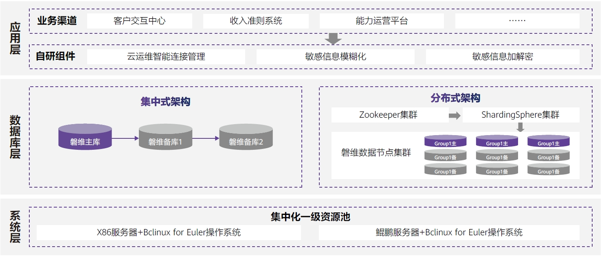

## 应用场景

随着5G和互联网业务的推广，中国移动业务数据量迅速增长，对数据库的稳定性、高并发、低时延的要求日益提升。同时为落实国家创新驱动发展战略，提升自主创新水平，中国移动基于openGauss研发磐维数据库商业发行版，已在河北公司落地实施多套数据库，逐步向核心系统推进。

## 解决方案

磐维数据库支持集中式和分布式两种数据库体系架构，结合数据规模、性能要求等因素针对不同场景，提供最优解决方案。集中式架构采用一主两备组网模式，保证数据安全和高可用；分布式架构采用ShardingSphere组件实现分布式管理，通过分库分表将数据分布到多个群组，为大数据高并发业务场景提供极致体验。

## 客户收益

• 磐维集中式模式以极简组网方式，实现低成本、高性能数据服务，相对于mysql库性能提升3~5倍；

• 磐维分布式模式以分布式组网方式，在大数据量场景下实现高并发、低时延，能力运营库数据处理性能提升4倍以上；

• 磐维与移动中台多个自研组件无缝对接，为业务发展和安全管控提供了更优质便捷的服务。

## 合作伙伴

    

