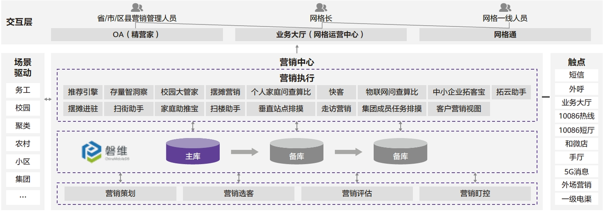

## 应用场景

为提升核心系统自主可控能力，浙江移动选取核心业务营销中心开展数据库升级，营销中心系统是为全省1亿多在线用户建设的统一营销策划集中运营门户，实现统一客户/产品/触点信息接入管理，支撑了全省精准营销的集中实施。磐维数据库作为拥有自主知识产权的国产数据库，已成功支撑浙江移动营销系统执行子中心摆摊营销、推荐引擎、存量智洞察等17个应用模块。

## 解决方案

浙江移动采用openGauss为内核的自研磐维数据库作为营销执行中心17款应用的核心数据库，通过自研数据同步工具-“鹊桥”完成异构数据库间的数据迁移和校验。依托磐维数据库强大的内核以及可靠的高可用机制，实现应用异地灾备、故障恢复RTO<10s以及前端应用日均千万级的API类访问。

## 客户收益

• 高可用、异地灾备：依托磐维数据库主备切换，实现RPO=0、RTO<10，异地机房高可用。

• 高性能、高并发：满足前端17款应用日均千万级别的API访问量，访问效率较之前提升较大。

• 数据可信传输与共享：基于自研“鹊桥”可信数据传输工具，实现异构数据实时传输与校验；同时也为迁移后的数据共享提供了通道，避免因数据库替换导致的数据孤岛。

• 验证批量割接技术：基于磐维数据库的高兼容性，批量进行前端业务割接，极大缩短数据库替换周期。

## 合作伙伴

    

