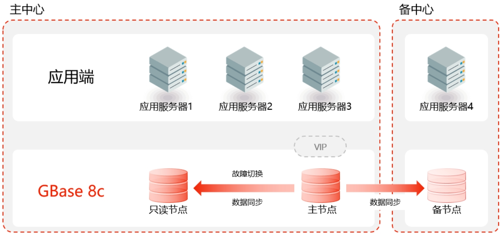

## 应用场景

为响应国产化相关要求，长城华西银行率先进行了国产化数据库选型并计划以外围系统为试点，逐渐展开国产化数据库替代核心交易系统，首先应用的是身份核查系统。

## 解决方案

• 要求国产数据库系统具备完善的功能以及良好的性能，实现对原有数据库系统的完全替换。

• 要求国产数据库对国产硬件、软件平台有较强的适配兼容能力。

## 客户收益

• 国产芯片和服务器上也可达到高端硬件的处理能力，满足业务需要；

• GBase 8c具有完全自主的知识产权，满足政策要求；

• 全局无单点，有效避免单点引起的系统不可用；

## 合作伙伴

    

