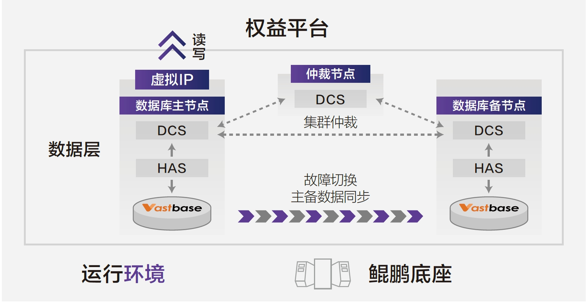

## 应用场景

桂林银行是广西资产规模最大的城市商业银行，2021年起桂林银行全面启动数字化转型，探索应用自主创新基础软硬件在业务系统的解决方案。

## 解决方案

海量数据提供基于openGauss的发行版Vastbase，搭配鲲鹏芯片。该应用系统设计并发为1000，日活跃用户数1.2万，Vastbase具备良好的并发支持能力，在高并发场景下性能也不会出现断崖式下跌。另外提供读写分离、集群状态实时查询、数据库进程自动恢复、自动切换等功能，满足客户对业务可用性的多种要求。Vastbase对原系统Oracle数据库有良好的兼容性，大大减少应用改造工作量。

## 客户收益

• 极致性能：性能相比升级前表现优秀，使业务效率提升10%-20%；

• 快速迁移：搭配海量exBase一键式异构数据库迁移平台，0.5人天完成系统数据迁移，一个月内配合用户完成应用适配，大大降低改造成本；

• 监控运维：部署海量VEM企业管理器，实现数据库统一监控管理，监控每日数据增长情况、设置备份定时任务等。

## 合作伙伴

    
    

