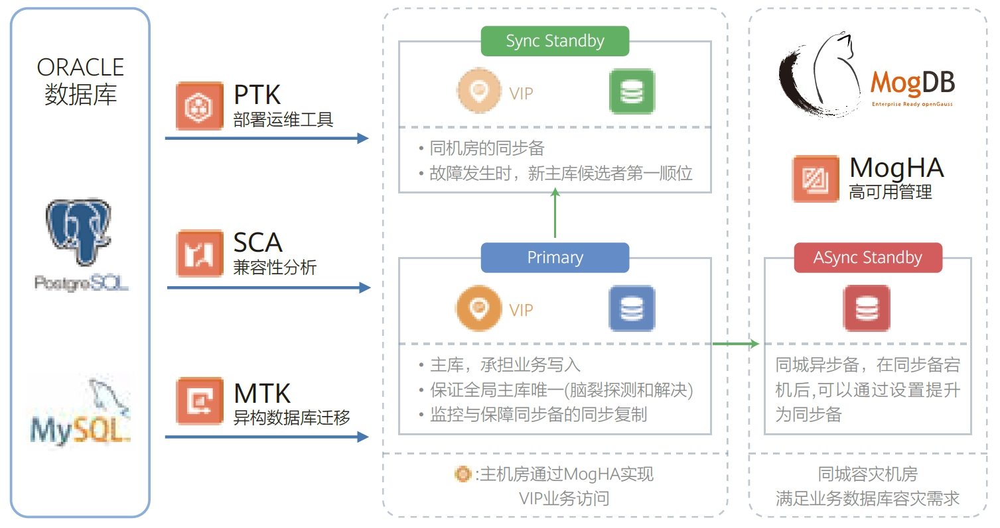

## 应用场景

为推进企业数字化转型建设，华宝基金针对从国外传统数据库向国内拥有自主知识产权的数据库进行转型，提出数据库选型需要满足开源社区活跃、商业数据库兼容性好、技术支撑能力强等需求；数据库转型按3-5年规划，从自研20+业务系统开始全面替换国外传统数据库，再推进外购业务系统适配新数据库，实现全栈自主创新建设。

## 解决方案

华宝基金选择了云和恩墨MogDB开启自研系统的数据库替换工作。MogDB配套的自动部署工具PTK、兼容性分析工具SCA、数据库迁移工具MTK确保了数据库从Oracle、PostgreSQL、MySQL
向MogDB的平稳迁移。主、备、级联同步备库、异步备库的结合部署，辅以MogHA高可用管理组件，满足了华宝基金数据库容灾要求，搭建起坚固的数据承载平台。

## 客户收益

• MogDB已完成华宝基金包括SCRM业务系统在内的多个自研系统的适配和迁移改造上线，2023年将继续推进更多自研系统的数据库改造工作，实现自主创新建设目标。
• 以SCRM系统为例，MogDB配套的兼容性分析工具SCA快速分析系统兼容性并提供改造建议，提升了研发工作效率，同时通过数据库迁移工具MTK实现了分钟级内完成数据库对象及数据的快速迁移改造，提升业务适配效率。
• 为满足华宝基金数据库容灾建设需求，MogDB部署一主两备的架构实现同城容灾建设，并结合了MogDB的高可用管理系统MogHA，使数据库的故障持续时间从分钟级降到秒级（RPO=0，RTO<10s），提升业务稳定性。

## 合作伙伴

    
    

