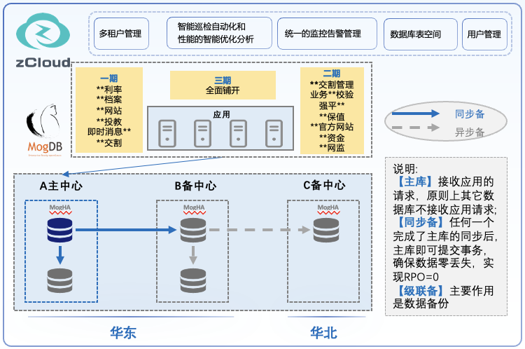

## 应用场景

上海期货交易所（以下简称上期所）是受中国证券监督管理委员会（以下简称证监会）集中统一监管的期货交易所。为推进IT全面升级，深化自主可控替代，上期所开始进行数据库改造。本次改造主要涉及套期保值、投资者教育、利率竞价等十多套业务系统。

 

## 解决方案

MogDB数据库助力上期所业务系统信创改造，项目采用一主多备多级联、跨中心跨区域（超过1000公里）的同步高可用方案，实现了数据零丢失（RPO=0）。

在上期所业务系统替代改造过程中，云和恩墨及MogDB提供如下技术支持：

- **高效运维**。采用zCloud数据库云管平台实现多源异构统一纳管，包括当前及未来的各类数据库，提升运维效率、降低运维成本；

- **简化交付**。采用PTK工具，完成多套系统的一键式安装部署，交付更简化、更快捷；

- **高可用性**。采用自研的MogHA组件，确保数据库及业务系统的高可用性；

- **迁移工具**。采用MTK工具，增量、全量相结合，快速完成迁移和转换；

- **数据对比**。采用数据对比工具MVD，在迁移迁、后进行数据对比校验，确保业务数据绝对准确、可靠；

- **C/C++增强**。创造性地规范了C/C++语言的驱动，且实现性能上的大幅提升，项目组已制定开发规范，并形成最佳实践进行推广赋能；

- **Java增强**。增强了Java调用存储过程的功能支持，对开发人员更友好、更便捷；

- **SQL及PL/SQL增强**。Oracle语法和存储过程的兼容度超过85%，通过MTK迁移后，仅需调整少量代码即可平滑地与应用完成适配。

 

## 客户收益

- 云和恩墨与上期所齐心协力攻克难关，客户最终满怀信心地交出了信创阶段性答卷，云和恩墨提供MogDB数据库、一整套工具链、专业的迁移改造服务等，助力上期所平滑、高质量、低代价地完成阶段性替代，让IT系统关键核心技术牢牢掌控在自己手中。

- 上期所多个业务系统的成功替代案例，为金融行业（尤其是头部期货交易所）的重要基础IT系统全栈自主可控替代提供了强有力的信心，在行业内形成了较好的示范效应，为openGauss大家庭打造更完备的生态链，更为为期货行业的信创替代树立了标杆。
