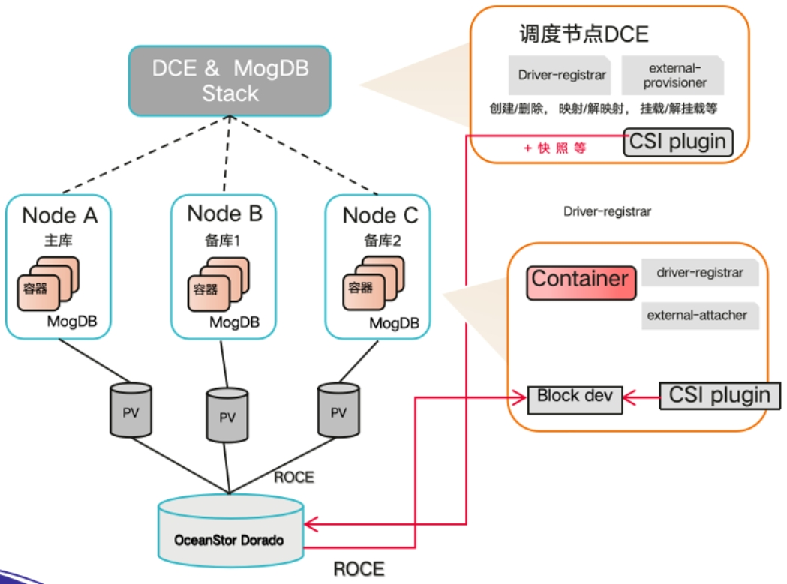
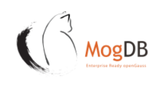

## 应用场景

四川天府银行始终秉承着稳中求进的理念，探索高效运维管理、提升数据库服务质量、资源按需分配、降本增效的全栈信息化改造方案。容器作为一种新兴操作系统级虚拟化技术，具备秒级部署、弹性伸缩、高效运维的优势，能够满足业务快速迭代的需求，因此四川天府银行自2021年起全面开展全栈容器化数据库应用建设项目。

## 解决方案

云和恩墨与四川天府银行、容器平台厂商结合实际场景。共同设计实现容器化数据库在容器平台运行与管理的总体方案。该方案在行方现有容器平台上部署 MogDB Container（MogDB容器版）集群来承载当前业务，同时配合 MogDB 集群统一运维管控平台 MogDB Stack，形成覆盖数据库全生命周期的管理和监控能力；在此基础上与上层应用对接，构建出一套自主创新的“全栈容器化数据库管理新模式”，即：容器平台 + MogDB container + MogDB Stack + APP container，实现全栈资源的统一调度、分配与管理。

## 客户收益

• 通过自定义新资源+引用K8S原生资源的方式，构建云原生的容器数据库集群资源模板，实现分钟级部署；
• 通过MogDB Operator对由多个MogDB pod组成的MogDB Cluster数据库进行数据库生命周期管理，实现容器数据库集群敏捷部署、故障自动切换、Pod弹性伸缩、数据备份&恢复等；
• 针对系统资源的限额，确保容器层的独立性、亲和性，从而实现精细化的资源管控；
• 2022年12月在生产第一和第二同城双中心，完成独立部署和测试。完成共计6个数据库实例的功能、性能和切换测试，以及自动化运营、监控等的功能实现。2023年基于容器平台的智能网点业务系统、 监管报送系统等系统上线。

## 合作伙伴

    
    

