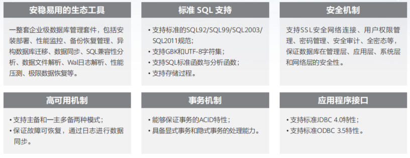

## 云和恩墨MogDB

MogDB是云和恩墨基于openGauss开源数据库的内核进行研发，推出的一款极致易用的企业级关系型数据库。MogDB具备金融级高可用和全密态计算的极致安全、面向多核处理器的极致性能、AI自诊断调优的极致智能能力，能够满足从核心交易到复杂计算的企业级业务需求。

## 产品亮点

### 高安全

• 业务无忧，故障切换时间RTO＜10s

• 精细安全管理：细粒度访问控制、多维度审计

• 全方位数据保护：存储&传输&导出加密

### 高可用

• 支持主备同步、异步以及级联备机多种部署模式

• 数据页CRC校验，损坏数据页通过备机自动修复

• 备机并行修复，10秒内可升主并提供服务

### 高性能

• 两路/四路鲲鹏服务器，性能分别可达150万tpmC/256万tpmC

• 面向多核架构的并发控制技术

• NUMA-Aware存储引擎

• SQL-Bypass智能选路执行技术

### 易运维

• 智能参数调优，结合深度强化学习和启发式算法，实现参数自动推荐

• 慢SQL诊断，多维性能自监控视图，实时掌控系统性能表现

• 在线自学习SQL时间预测、快速定位、急速调优

## 应用场景

### 交易型应用

大并发、大数据量、以联机事务处理为主的交易型应用场景，如电商、金融、O2O、电信CRM/计费等，应用可按需选择不同的主备部署模式。

### 物联网数据

在工业监控与远程控制、智慧城市能力延展、智能家居、车联网等物联网应用场景下，传感设备多、采样率高、数据存储为追加模型，满足操作和分析并重的要求。

