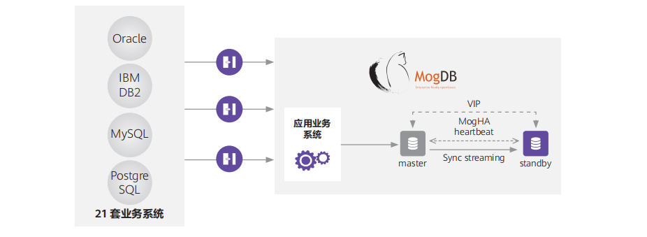

## 应用场景

为保障数据安全，应对新业务给IT系统带来的性能、弹性、成本等方面的挑战，哈尔滨银行开始了数据库改造工作。客户提出数据库产品需要具备完善的事务处理机制，支持高并发业务场景下的事务处理，并支持数据库存储加密、数据传输通道加密等安全机制。

## 解决方案

哈尔滨银行采用数据库 MogDB 替换多个B类和C类系统，MogDB 配套的数据库迁移工具 MTK 、高可用
管理系统 MogHA 和备份恢复工具 BRM 确保了数据库平稳迁移和高效管理。

## 客户收益

• MogDB 已完成哈尔滨银行的6个B类系统和3个C类系统上21套业务系统的数据库替换，为接下来的A类核心系统数据库替换积累了经验。

• 以某A类系统为例，MogDB 配套的数据库迁移工具 MTK 实现了10分钟内完成全量、迅速、无差错的数据迁移。

• 不同业务系统所对应的一主一备、一主多备的架构结合了 MogDB 的高可用管理系统 MogHA，使数据库的故障持续时间从分钟级降到秒级（RPO=0，RTO<60s）。

• MogDB 配套的备份恢复工具 BRM 使数据恢复时间不超过1小时(2GB左右)，总业务流程恢复时间不超过4小时。

## 合作伙伴

    
    

