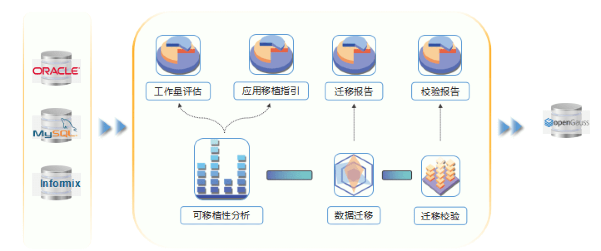

## 应用场景

特殊资产清收系统借助数字智能能力，开展估值模型建设迭代升级工作，构建特资领域的估值定价专业能力，实现特资处置质效提升。围绕“智慧管理”理念，资产清收系统进行了定位升级、功能优化、流程再造等改进，灵活的业务升级对数据库系统提出了更高的要求，系统数据库从 oracle 迁移至 openGauss。

## 解决方案

openGauss 数据库迁移涉及数据库结构和数据迁移、应用适配。兴业银行借助第三方数据库迁移工具，实现自动化、流程化迁移，解决了迁移前后数据库的字符集、存储过程语法兼容等问题。

## 客户收益

· 系统数据迁移至 openGauss 数据库后，批处理脚本的性能较原有方案大幅提升，很好的提升了系统对业务的支持能力。

## 合作伙伴

