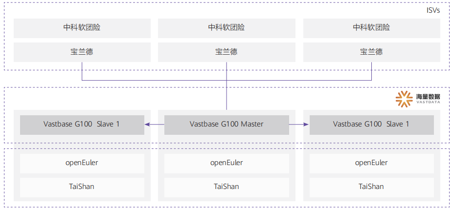

## 客户挑战

中华保险团险业务发展迅速，现有系统数据库无法满足需要，尤其在数据一致性，与第三方中间件兼容性和大流量业务洪峰时的性能和体验方面都面临着不小困难。

## 解决方案

数据库采用海量数据基于 openGauss 的商业发行版 Vastbase，连同鲲鹏计算平台和 openEuler 形成全栈解决
方案，为中华保险提供极致的性能。

## 客户收益

• 在批量导入、批量加人、保全更换被保险人等场景中，性能平均提升 3 倍左右。

• 迁移过程直观可控：Vastbase 对国外主流商业数据库高度兼容，迁移成功率高达 99.4%，工作量< 5 人天。

• 迁移时间：平均 2 周内实现迁移上线。

## 合作伙伴

    
    

