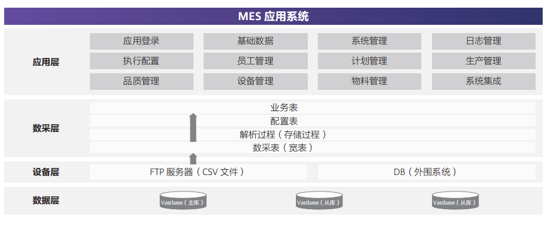

## 客户挑战

作为国内领先的高端集成电路晶圆制造企业，该企业在迈向原子级制程工艺道路上，对制造的核心数据管理性能、实时性和稳定性提出更高标准的要求。现有系统无法满足该企业未来发展，急需新数据管理方案支持其未来发展。

## 解决方案

该企业采用openGauss发行版海量数据Vastbase，并选用一主两备，两中心的部署方案。Vastbase具备业界领先的高性能，带来芯片制造时更短的数据处理，使数据实时性更强。两中心方案为系统整体带来金融级可靠性，芯片数据供给与管理更有保障。

## 客户收益

### 核心生产实时数据流转系统方案价值：

• IT基础架构全栈国产化保驾护航

• NUMA优化高并发强大事务处理能力

• 本地高可用同城双中心保障业务连续性

### 运行效率：

在相同环境中，相比原Oracle系统，TTPT库SQL性能提升7.36%，SPC库SQL性能提升25.33%。

### 性能平稳：

内核机制优化，保障系统运行平稳无抖动；高可用组件对数据库性能影响小于1%，满足用户业务使用需求。

## 合作伙伴

    
    

