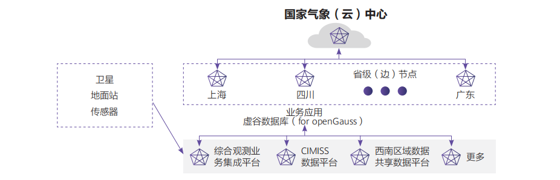

## 客户挑战

“天擎”是中国气象为数字气象、智慧气象打造的领先的气象基础服务平台。四川省相对其他地方面积广，地理条件复杂，气象数据丰富。各个气象子平台在数据上报与交换时，对现有“天擎”系统设计的国家“云”+省“边”架构的性能和效率提出了巨大的挑战。

## 解决方案

四川省气象探测数据中心创造性地在“云”+“边”基础上，加入子业务平台的“端”系统，形成“天擎”的“云，边，端”三级数据管理架构。把原来的汇集在云与边侧的数据管理和交换的大部分压力卸载到端侧。端侧使用openGauss商业发行版-虚谷数据库（for openGauss），其业界领先的2路150万tpmC性能，和金融级稳定性，与鲲鹏计算平台、openEuler结合，配合虚谷分布式数据库体系，实现四川气象“天擎”数据秒级汇总和交换，PB级数据管理。

## 客户收益

• 接入数据资料：全国城镇精细化天气预报原始数据、中国地面分钟数据、中国高空秒级数据、全球高空定时值资料等几十类资料。
• 接入应用：城镇细化天气预报、大城市6小时精细化天气预报、台风实况与预报、地面降水量预报、高空定时值预报。

## 合作伙伴

    

