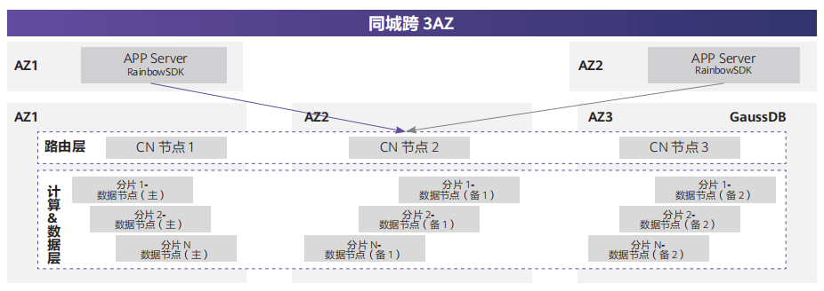

## 客户挑战

央广网作为国家级广播网络媒体平台，肩负向全球讲好中国故事，传播好中国声音的重任。随着全球听众
增加，当前基于 MySQL 的全球华语广播系统逐渐不堪重负，体验无法满足听众要求。

## 解决方案

针对 MySQL 的性能不足、并发度差的问题，央广网选用 openGauss 的发行版海量数据 Vastbase，将 Vastbase 替代 MySQL 进行平滑迁移；首先 Vastbase 数据库高度兼容 MySQL，并且适配 PHP 与 Nginx；迁移 MySQL 到 Vastbase 过程中，可以做到一次性快速平滑迁移，无需任何人工手动修改部分。

## 客户收益

• 兼容好：高度兼容 MySQL，与原有系统 PHP, Nginx 等适配度高。
• 高可靠性：Vastbase 数据库高可靠、高安全，易监控，并且能快速恢复响应。
• 性能强：综合性能较之前提升 30%，并可持续优化提升；同时金融级可靠性、安全和运维能力为央广节目平台提供更大的创新空间。

## 合作伙伴

    
    

