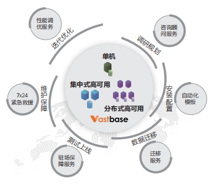

## 客户挑战

<table class='cloud-table'>
    <tr>
        <td>安全稳定</td>
        <td>某市政务云平台的建设某市政务云平台的建设需要充分考虑本质与过程安全，关后门、堵漏洞，切实保障用户信息的安全</td>
    </tr>
    <tr>
        <td>平台通用性</td>
        <td>在硬件上支持x86、鲲鹏等异构计算架构，并且能广泛兼容各种商业、开源软件，满足政企用户群的多样化需求</td>
    </tr>
    <tr>
        <td>高效迁移</td>
        <td>为旧应用迁移提供保障</td>
    </tr>
</table>

## 解决方案

### 自动化部署模板

提供面向多种应用规模和多种部署架构（包括单机、高可用集群、分布式集群等）的实例模板，通过自动化和标准化，大幅提升实交付速度和交付质量。

### 丰富的企业特性

支持空间数据、全文检索、时序数据、流数据及图数据，面向更多适用场景，提供专业化支持能力。

### 全生命周期技术保障

由数据库技术专家组成的数据库技术服务团队，提供全数据库、囊括了咨询顾问\分析规划\数据迁移\上线保障\售后维护\分析调优等阶段的全生命周期技术保障。

### 敏捷适配

为政务云上各业务系统及各委办局用户提供敏捷适配能力，打造一体化、高效的政务平台。

### 业务保障

满足用户对系统功能、性能、高可用、安全性和易用性的要求，提供7*24小时在线服务支持，保障业务系统平稳运行。

### 快速进化

为政务云提供自动化交付、自动化监控运维管理以及自动化故障切换等新能力。

## 客户收益

• 高兼容度： Vastbase 高度兼容原数据库，实现高效迁移。
• 更高性能： 在不同业务场景下，性能提升48%～69%。
• 更高性价比： 与早期其他友商方案相比，新的全栈体系化替代方案性价比更高。

## 合作伙伴

    
    

