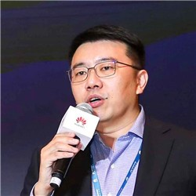
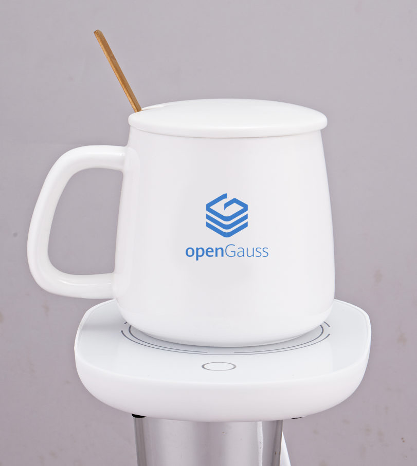

+++
title = "openGauss上海Meetup"
time = "2021/01/23"
tags = "会议"
label = "线上线下"
location = "上海"
img = "/zh/events/2021-01-23/poster.png"
img_mobile = '/zh/events/2021-01-23/poster.png'
link = "/zh/events/2021-01-23/meetup.html"
author = "openGauss"
summary = "openGauss携手合作伙伴云和恩墨，相约上海滩"

+++

### 活动背景

openGauss社区用开源的魅力吸引真正热爱技术并持续探索的用户和开发者，Meetup通过打造一个自由、活跃的前沿技术交流空间，定期邀请业内专家分享与深度探讨数据库领域的前瞻性技术思考与经验，共同构建一个能够融合多元化技术架构的企业级开源数据库社区。

### 时间

2021年1月23日（周六）13:30-17:00

### 地点

上海市徐汇区虹桥路3号港汇广场二座12楼：Distrii办伴港汇中心路演厅

### 主办单位

华为、云和恩墨、openGauss社区

### 合作宣传

上海鲲鹏生态创新中心、墨天轮、PostgreSQL中文社区

### 报名参会

地址：https://www.modb.pro/event/259

### 活动议程

<strong>胡正策：openGauss数据库领域总经理</strong>

个人简介：openGauss数据库领域总经理，华为15年研发经验，致力于把企业级数据库能力带给用户。

<strong>朱承廉  云和恩墨副总经理</strong>

个人简介：华东理工通信工程专业，香港大学MBA，拥有20年的移动通信、软件服务从业经历，先后于上海贝尔、华胜天成、赛门铁克等公司任软件研发工程师、客户经理、区域总经理。2017年加入云和恩墨任华东区总经理，2019年任公司副总经理。

<strong>薛忠斌 openGauss生态经理</strong>

个人简介：中国人民大学信息学院DEKE实验室博士，清华大学&国华电力研究院博士后，主要从事内存数据库、移动对象数据库和电力大数据相关研究，在国内外学术会议期刊发表论文十余篇，相关专利5项。

<strong>刘旭  云和恩墨优化专家</strong>

个人简介：2005开始接触数据库，2014年加入云和恩墨，之前从事过电信行业基于Oracle数据库的开发、优化和SQL审核工作。现阶段主要参与MogDB数据库的测试和文档编写等工作。

<strong>田文罡  openGauss首席架构师</strong>

个人简介：openGauss技术委员会主席、华为公司数据库C-TMG主任、16年数据库开发经验。

<strong>刘伟 云和恩墨高级研究员</strong>

个人简介：前微博DBA，主要研究方向为开源数据库，分布式数据库，擅长自动化运维以及数据库内核研究。

<strong>胡翔宇： openGauss数据库架构师</strong>

个人简介：华为技术专家，计算产品线数据库架构师。曾在Intel、Microsoft担任研发负责人，在指令集，OS，数据库，云计算方面有丰富的工作经验和技术积累；目前负责鲲鹏计算数据库技术规划和总体竞争力。

### 活动礼品

<strong>签到伴手礼：openGauss加热杯</strong>

<strong>抽奖礼品：</strong>

一等奖华为荣耀手表1个，二等奖华为无线耳机2个，三等奖华为荣耀手环3个

<strong>关于参会与防疫须知：</strong>

1、随申码和防疫行程卡（近14天记录）均为绿色，且体温检测正常者方可参会。

2、会议现场为大家提供免洗洗手液和备用口罩。

3、会议期间请全程佩戴口罩。