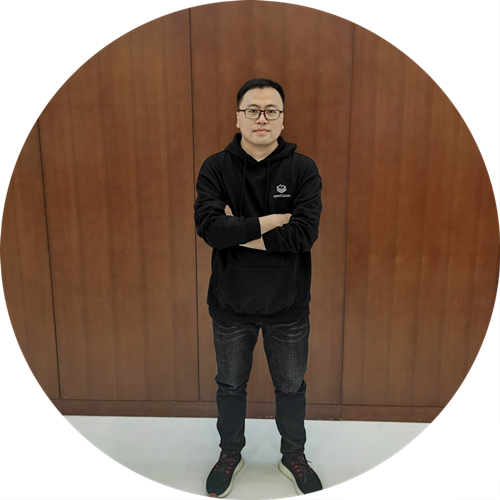
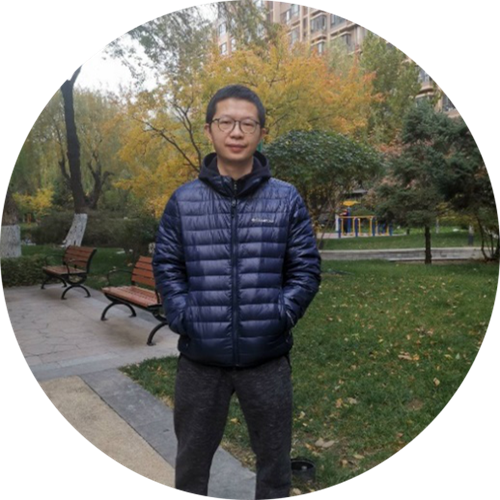

+++
title = "啥？openGauss Meetup将在深圳举行？"
time = "2021/03/26"
date = "2021-03-26"
tags = "会议"
label = "线下"
location = "深圳"
img = "/zh/events/2021-03-26/poster.png"
img_mobile = '/zh/events/2021-03-26/poster.png'
link = "/zh/events/2021-03-26/meetup.html"
author = "openGauss"
summary = ""

+++

### 活动信息

主题：把企业级数据库能力带给用户

时间：2021年3月26日（周五）14:00-17:10

地点：深圳•国际开源谷 深圳福田区中康路136号 新一代信息技术产业园4栋23层 

合办方：openGauss社区、海量数据

支持方：开放原子开源基金会

### 关于Meetup

openGauss社区用开源的魅力吸引真正热爱技术并持续探索的用户和开发者，Meetup通过打造一个自由、活跃的前沿技术交流空间，定期邀请业内专家分享与深度å探讨数据库领域的前瞻性技术思考与经验，共同构建一个能够融合多元化技术架构的企业级开源数据库社区。

3月26日，openGauss携手北京海量数据技术股份有限公司 、开放原子开源基金会举办深圳Meetup活动，并成立openGauss 深圳用户组（简称oGUG）， 这一次不仅有大咖面对面交流的机会，更多关于oGUG的福利与权益，也将在此次活动正式官宣。想更深入融入openGauss研发团队了解其技术构造吗？想第一时间了解openGauss在商业应用上的新动态吗？想知道如何获得openGauss的官方支持获得职业推荐与社区认证吗？想成为openGauss的专属用户代表KOL吗？我们都将3月26日openGauss深圳Meetup为你一一揭晓！

北京海量数据技术股份有限公司（603138.SH）成立于2007年，总部位于北京，是中国数据技术领航企业。十几年来，专注于数据库产品研发、销售和服务。海量数据公司一直是openGauss的重要贡献者，深度参与开源社区建设。作为第一家也是目前唯一一家以数据库为主营业务的上海主板上市公司，海量数据始终坚持“专注做好数据库”的初心，基于多年数据库研发积累，与openGauss社区深度合作，推出了高性能、高兼容、高安全的企业级关系型数据库Vastbase，是目前openGauss商业版数据库国产化的优秀实践。

开放原子开源基金会（以下简称“开源基金会”）是唯一一家在民政部注册的致力于开源产业公益事业的非营利性独立法人机构。开源基金会的服务范围包括开源软件、开源硬件、开源芯片及开源内容等，为各类开源项目提供中立的知识产权托管，保证项目的持续发展不受第三方影响，通过开放治理寻求更丰富的社区资源的支持与帮助，包括募集并管理资金，提供法律、财务等专业支持。

### 活动议程

13:30-14:00	现场签到

14:00-14:10	开场致辞 openGauss数据库领域项目总监 蔡亚杰

14:10-14:20 欢迎致辞  深圳国际开源谷运营负责人 刘跃峰

14:20-14:50	openGauss多核优化技术内幕	openGauss技术委员会周平高

14:50-15:20	openGauss数据库透明加密原理介绍及代码解读 海量数据 石青

15:20-15:50	从Java中间件jdbc客户端看数据库 宝兰德售前总监 詹年科 

15:50-16:20	openGauss 鲲鹏多核优化实践	数据库内核工程师阙鸣健

16:20-16:50	基于数据库流计算技术的最佳应用实践 视源股份系统运维部经理 周俊

16:50-17:10	openGauss深圳用户组成立仪式

17:10-17:20	抽奖与合影留念

### 讲师信息

<strong>蔡亚杰 openGauss数据库领域项目总监</strong>

openGauss 数据库领域项目总监，华为10年数据库研发经验。

<strong>周平高 openGauss技术委员会成员</strong>

个人简介：毕业于华中科技大学，从事数据库内核研发工作数十年， 2011年加入高斯参与高斯数据库多个版本研发工作，在SQL引擎，分布式框架，性能等多个领域有深入的研究。

<strong>石青 海量数据高级软件研发工程师</strong>

个人简介：为了防止第三方人员绕过数据库认证机制直接读取数据文件中的明文数据，openGauss数据库提供了透明加密技术保护磁盘数据文件。此次议题分享，将围绕AES及SM4加解密算法、秘钥生成及校验、数据透明加解密过程等技术原理及代码实现。

个人介绍：就职于北京海量数据技术股份有限公司，任高级软件研发工程师，5年开源数据库内核研发经验。

<strong>阙鸣健 数据库内核工程师</strong>

个人简介：在华为公司从事数据库功能特性交付与性能优化工作，有多年数据库调优经验，在MySQL/GaussDB 100/PostgreSQL/openGauss等数据库均有成果性能调优案例。

<strong>周俊  视源股份系统运维部经理 集团资深应用DBA</strong>

个人简介：现任视源股份系统运维部经理，集团资深应用DBA，精通Oracle/MySQL/PostgreSQL等数据库；擅长性能调优、故障处理、数据架构设计、数据集成、流计算等；长期专注于数据集成、流计算、数据库开源技术探索及生产应用

<strong>詹年科 现任宝兰德售前总监</strong>

个人简介：IT老兵，20年来专注于业务基础架构软件的开发、架构设计，对分布式计算、中间件技术、云原生技术相关领域有比较全面的了解。

### 活动福利：

伴手礼：openGauss气质稳重款文化衫

<strong>抽奖福利：</strong>

一等奖：华为运动手表*1

二等奖：华为无线耳机*2

三等奖：华为荣耀手环*3

### 报名信息

网址链接：https://www.slidestalk.com/m/374

