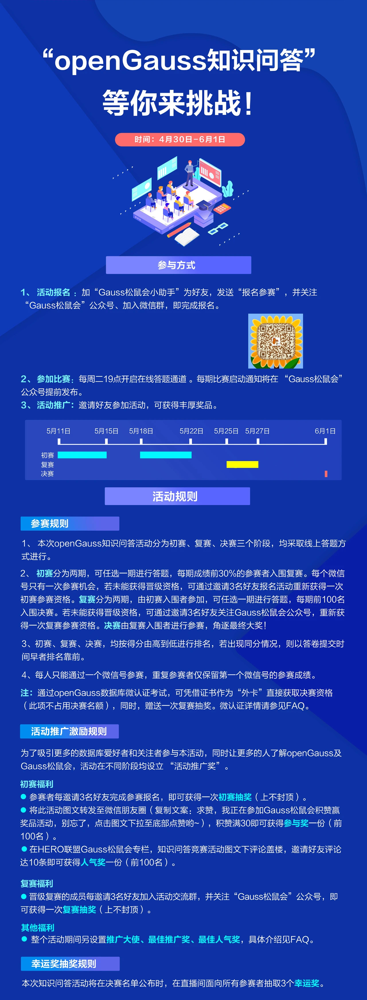

+++
title = "学知识，赢奖品！第二届openGauss知识问答活动，等你来挑战~"
time = "2021/06/01"
date = "2021-06-01"
tags = "活动"
label = "线上线下"
location = "线上"
img = "/zh/events/2021-06-01/banner.png"
img_mobile = "/zh/events/2021-06-01/banner.png"
link = './events/2021-06-01/meetup.html'
author = "openGauss"
summary = ""
+++

openGauss自2020年6月30日上线开源，至今已更新至2.0.0版本。相信很多伙伴正在学习或者使用openGauss，但是，你对openGauss了解多少呢？

Gauss松鼠会主办的第二届openGauss知识问答活动即将开启，本次活动奖品价值总额达8万元，参与线上问答，只需答3次，每次十分钟就有机会获得华为PAD、手表、运动手环、机械键盘、华为耳机、京东购物卡等精美礼品！转发朋友圈集赞、评论盖楼、邀请好友参赛，更多“活动推广奖”等着你，马上行动起来，一起来瓜分8万元奖池吧~

**PS：初赛题目主要来自Gauss松鼠会公众号近期发布图文、直播回顾等。参与的小伙伴现在可以学习起来咯~**

 FAQ : 

**Q1: 我想邀请好友参赛，具体如何操作？**

**A1**: 邀请好友参赛需完成如下步骤：

1、受邀人关注“Gauss松鼠会”公众号。

2、受邀人添加Gauss松鼠会小助手为好友，并备注推荐人的微信号或者微信昵称。

3、邀请者将好友拉进自己所在微信群，并向Gauss小助手反馈邀请好友人数，微信号/微信昵称/好友入群截图其中之一。

**Q2: 我想参加抽奖，怎样获得抽奖机会？最多可以抽几次？**

**A2: 初赛阶段**：每邀请三位好友加 Gauss松鼠会小助手完成参赛报名，即可获得抽奖码进行抽奖，次数不限。

**复赛阶段**：入围复赛的成员，每邀请三位好友进活动群，并关注公众号，即可获得高级抽奖一次，次数不限。

**Q3：朋友圈集赞具体规则是什么，如何转发？**

**A3**: 转发规则如图所示：

**复制文案**：求赞，我正在参加Gauss松鼠会积赞赢奖品活动，别忘了，点击图文并下拉至底部点赞哟~

集赞满30个，截图发“Gauss松鼠会小助手”确认后，提供姓名、联系方式及邮寄地址，**名额限100名，先到先得（未按规则转发者结果无效）。**

**Q4: 我想参加HERO联盟Gauss松鼠会专栏的评论盖楼活动，具体怎么参加？**

**A4**: HERO联盟Gauss松鼠会专栏地址（也可点击文末“阅读原文”）：

https://developer.huaweicloud.com/hero/group-1347.html

**具体步骤**  ① 加入联盟；② openGauss知识问答活动图文下评论；③ 邀请好友在自己的评论下盖楼。如图所示：

当自己的评论下累计满10条不同朋友的评论，即可获得人气奖一份。

注：如一个人进行多次评论盖楼，仅评论最多的那条生效。此活动自5月6日开始。

**Q5: 最佳人气奖、最佳推广奖、推广大使有什么区别？**

**A5: 最佳人气奖**得主为HERO联盟Gauss松鼠会专栏下评论盖楼层数最多者获得，最佳推广奖得主为邀请好友参赛报名，邀请最多的前三名获得，推广大使针对邀请好友参赛达20人和40人报名参赛的奖励。

**Q6: 对于“推广大使”我邀请了40位好友参赛，是否可以获得同时获得20位好友的奖品？**

**A6: 不可以**，推广大使邀请20人、40人参赛奖项只能选其一获得，若40人奖项10个已领取完毕，之后的只能获得邀请20人参赛奖，奖品数量有限，先到先得~

**Q7: 什么时候开始答题？**

**A7**: 知识问答活动分为初赛（2期）、复赛（2期）、决赛（1期），每次比赛前，公众号提前发出比赛通知及问答比赛活动入口，请留意微信公众号通知。

**Q8: 如果我参加初赛或者复赛的第1期获得了晋级资格，还需要参加后续第2期的比赛吗？**

**A8**: 不用参加，初赛和复赛分为2期次是为了确定哪些选手进入下一轮比赛，如果您第1期活动后就已经取得了晋级资格，后续一期不用参加，直接等待参加下一轮比赛即可。同时，您可以通过邀请好友获取抽奖资格。

**Q9: 如何考取openGauss数据库微认证？**

**A9**: openGauss微认证考试将在五月中旬推出，后续将通过Gauss松鼠会公众号平台发布考试地址。届时，通过微认证考试的参赛者可凭借证书直接晋级决赛。

**Q10: 如果自己不参加线上答题，可以通过推广获得哪些奖品？**

**A10**: 除复赛抽奖和决赛奖品，其余奖品皆可通过相应推广方式获得。

**Q11: 如果抽到奖品，如何领取？**

**A11**: 在中奖后的3个工作日内，小助手会联系您获取邮寄地址。

[阅读原文](https://developer.huaweicloud.com/hero/group-1347.html "阅读原文")

