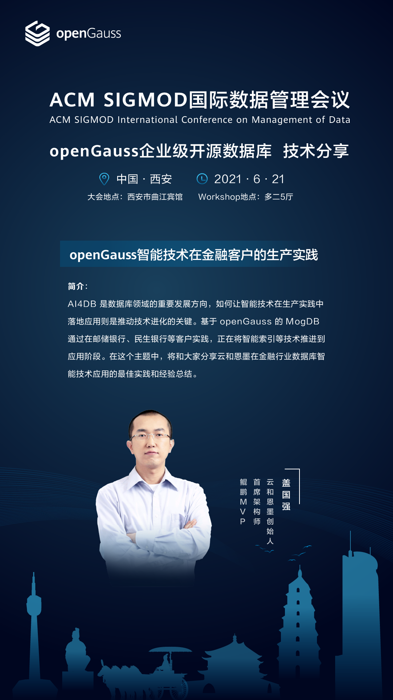

+++
title = "ACM SIGMOD 国际数据管理会议：openGauss企业级开源数据库技术分享"
time = "2021/06/21"
date = "2021-06-21"
tags = "会议"
label = "线下"
location = "西安"
img = "/zh/events/2021-06-21/banner.png"
img_mobile = "/zh/events/2021-06-21/banner.png"
link = './events/2021-06-21/sigmod.html'
author = "openGauss"
summary = "openGauss智能技术在金融客户的生产实践"
+++

AI4DB 是数据库领域的重要发展方向，如何让智能技术在生产实践中落地应用则是推动技术进化的关键。
基于 openGauss 的 MogDB 通过在邮储银行、民生银行等客户实践，正在将智能索引等技术推进到应用阶段。
在这个主题中，将和大家分享云和恩墨在金融行业数据库智能技术应用的最佳实践和经验总结。