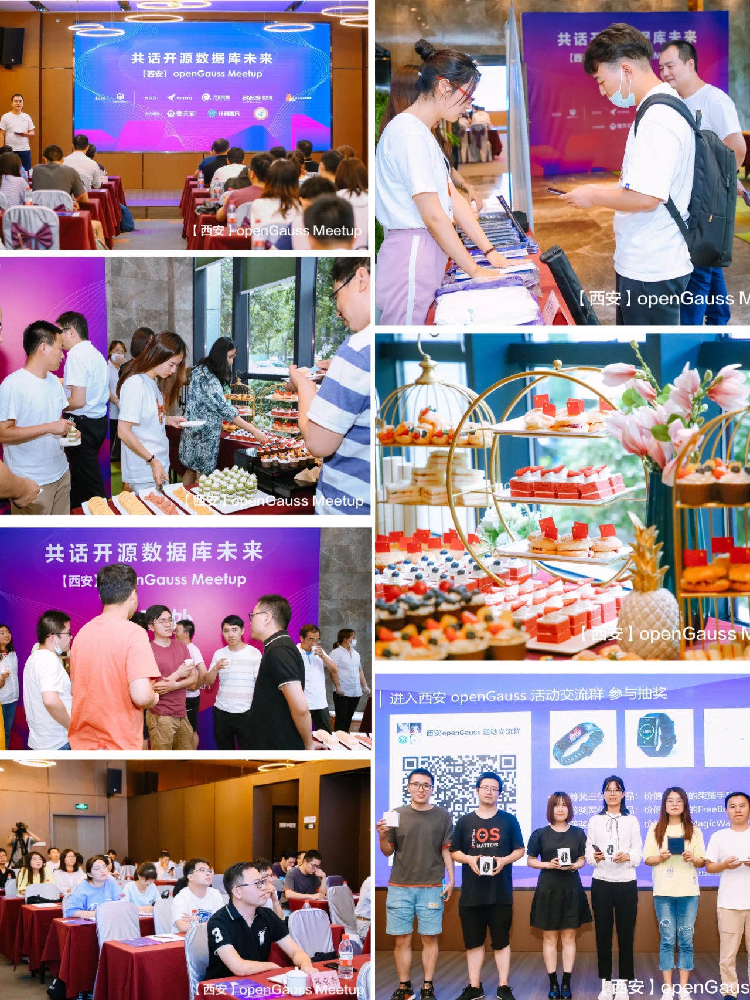
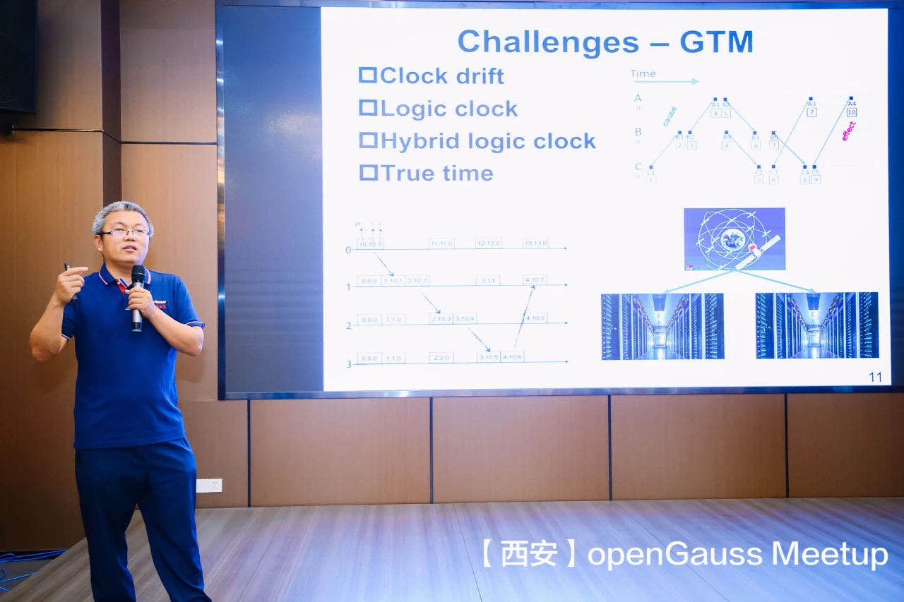
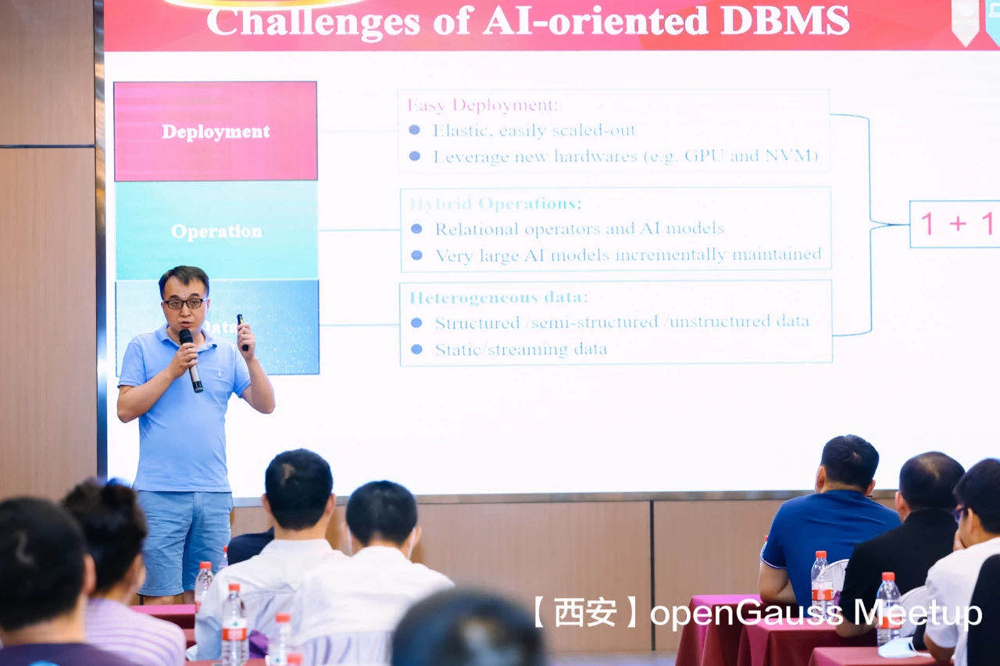
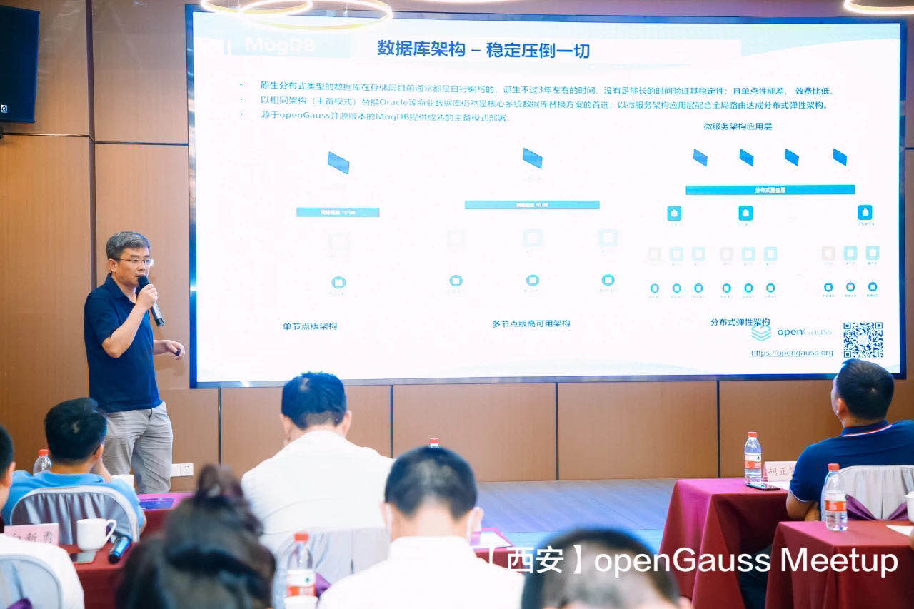
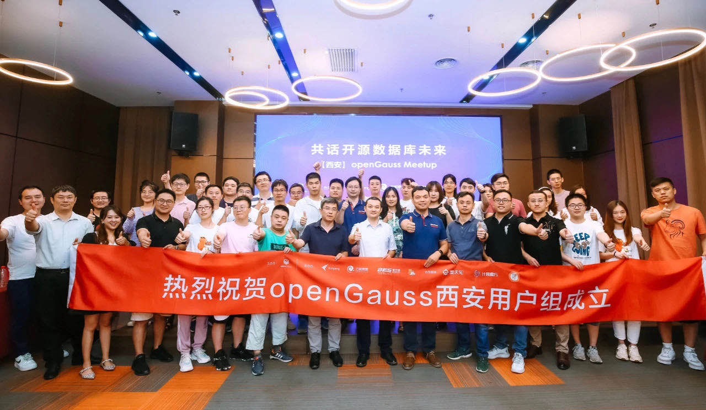

+++
title = "西安openGauss Meetup成功举办，共建最佳学术创新平台"
time = "2021/06/28"
date = "2021-06-28"
tags = "会议"
label = "线下"
location = "西安"
img = "/zh/events/2021-06-28/合照.jpg"
img_mobile = "/zh/events/2021-06-28/合照.jpg"
link = './events/2021-06-28/meetup.html'
author = "openGauss"
summary = ""
+++

<video id="my-video" class="video-js" controls preload="auto" width="100%" >
    <source src="https://learningvideo.obs.myhuaweicloud.com:443/%E8%A5%BF%E5%AE%89Meetup/%E5%8D%8E%E4%B8%BAopengauss30s3.0.mp4 ">您的浏览器不支持video标签。
</video>

6月25日，由openGauss社区主办，陕西鲲鹏创新中心、云和恩墨、宝兰德、Gauss松鼠会联合举办的【西安】openGaussMeetup 成功举办，此次活动邀约openGauss数据库产品总经理  胡正策、清华大学教授 李国良、西北工业大学教授、博士生导师陈群、陕西鲲鹏生态创新中心 CTO 谷羽新、云和恩墨2020产品事业部总经理 张皖川、北京宝兰德软件股份有限公司售前总监 詹年科、openGauss项目总监 蔡亚杰等数据库领域大咖发表技术演讲，分享了数据域技术创新与行业实践，发布了基于openGauss的创新研究计划。

**此次活动吸引了西安地区各个行业的40+家企业的近百名专家和开发者踊跃参与，在线观看超过6000人次，并在会上正式成立openGauss西安用户组。**此次主题为“共创openGauss学术创新平台”的Meetup与学术界紧密合作，是openGauss生态行之路的重要一步。

活动开始，openGauss数据库产品总经理 胡正策分享了在开源数据库领域的一些创新实践与思考，他提到未来是万物互联、万物感知、万物智能时代，数据爆炸式增长，对于我们传统的数据管理软件带来了新的挑战，其中数据库作为数据重要承载的平台之一，成为技术创新的焦点。当前虽然国内数据库百花齐放，但是关键核心技术是要不来、买不来、讨不来的，只有真正具备数据库内核“根技术”，才能抓住数据库的创新主动权、发展主动权。树高叶茂，系于根深，openGauss将矢志不渝持续聚焦在数据库“根技术”持续突破，为各类数据库应用创新夯实基础；而在数据库领域实现前瞻性基础研究、形成引领性原创成果重大突破，这块是广大学术圈学者所擅长的，只有"产学研用"全生态链、全产业链合力攻坚，才能共同促进数据库学科的发展。当前已有很多头部高校的教授和学者基于openGauss作为学术创新平台，来探索前沿课题、形成科研成果，面向未来希望能够有更多的高校加入openGauss社区，共建、共享、共治，让openGauss成为最佳学术创新平台。

**华为计算产品线openGauss数据库产品总经理 胡正策**

华为openGauss是一款企业级开源数据库，具备高性能、高安全、高可用、智能运维等核心特征。随着社区的发展，openGauss也吸引了越来越多的学者和学生加入，并为广大科研工作者提供了一个便捷的开发平台，促进了openGauss生态的进一步发展。

会议当天，清华大学教授 李国良就数据模型选取、大规模集群管理、自动化部署、硬件适配优化等维度对数据库领域当前面临的若干瓶颈进行了深入的剖析，并结合产业、学术界最新研究成果，针对上述问题给出了相应的解决方案，同时对数据库领域未来的发展趋势做出了展望。

**清华大学教授 李国良**

随后，西北工业大学教授、博士生导师 陈群为大家带来了《面向AI的数据管理》的主题分享，从用好AI、服务好AI两个维度对业界主流数据库进行详细分析，并归纳目前业界将AI与数据库相结合的主要方案及优缺点，指出AI时代的数据库所面临的挑战和机会。

**西北工业大学教授、博士生导师陈群**

openGauss作为发展鲲鹏生态的重要开源项目，此次Meetup与陕西鲲鹏创新中心的合作，助力推动鲲鹏计算产业的发展和进步，协同构建以技术为核心的鲲鹏生态体系。会上，陕西鲲鹏生态创新中心 CTO 谷羽新发表了《openGauss在鲲鹏创新中心的生态落地》的分享，阐述了鲲鹏计算生态全景、鲲鹏创新中心使能应用的最新进展，并表示将携手openGauss及生态伙伴，围绕鲲鹏，共同构建通用计算产业生态。

**陕西鲲鹏生态创新中心 CTO 谷羽新**

作为openGauss的合作伙伴，云和恩墨基于对openGauss核心架构的深刻理解，深度结合各行业应用场景特点和需求，历经多年匠心打磨，推出企业级关系型数据库MogDB。云和恩墨2020产品事业部总经理张皖川为大家带来“持续打造最易用的openGauss商业发行版”的主题分享，主要分享了最新发布的 MogDB 2.0相关技术特性及进展以及MogDB在金融行业的商业落地实践。

**云和恩墨2020产品事业部总经理 张皖川**

此次活动的合作伙伴北京宝兰德软件股份有限公司，是一家专注于基础软件产品和方案研发及推广的上市企业。目前公司产品线已经覆盖了基础软件领域的各种中间件、容器PaaS平台、智能运维和大数据等多个方向。数据的高效使用需要业务应用的良好架构，来自宝兰德售前总监 詹年科在会议上从业务中间件角度分享了数据库中间件一些基础技术。

**北京宝兰德软件股份有限公司售前总监 詹年科**

随后，来自openGauss的研发总监蔡亚杰分享了关于openGauss社区商业发行版认证相关内容，从认证流程、认证框架、认证结果及证书几方面为大家进行了详细的介绍。

**openGauss项目总监 蔡亚杰**

本次活动除了相关技术专家、学者、生态伙伴带来的行业洞察、技术分享和实践案例之外，还进行了圆桌论坛环节。

**圆桌论坛**

出席本次圆桌论坛的嘉宾从左到右分别是：陕西鲲鹏生态创新中心 COO 王涛、西北工业大学教授、博士生导师陈群、  openGauss数据库产品总经理  胡正策、云和恩墨2020产品事业部总经理 张皖川、北京宝兰德软件股份有限公司售前总监 詹年科各位专家和行业大咖就《如何共建openGauss学术创新平台》，《鲲鹏产业以及数据库产业发展》等话题纷纷发表了自己的独到见解及充分讨论，大家一致认为要想把数据库这个基础软件生态要做好，离不开产业界、学术界的合力攻坚，从国计民生行业数据库应用的最紧迫问题和长远需求出发，大家一起进行原创性、引领性的技术攻关，构建数据库根技术，打造数据库根社区和主流生态。

企业级数据库openGauss开源一年以来，社区迅速壮大，生态蓬勃发展，来自西安openGauss的现有用户，在此次活动上进行了openGauss西安用户组成立仪式，之后该用户组将就openGauss技术特性、最佳实践、运营进展等方向进行持续的线上及线下自由交流及后续运营。

**openGauss西安用户组首批成员分别是：**

. Organizer 陕西鲲鹏生态创新中心 COO   王涛

. Member   云和恩墨Python开发工程师  刘珲

. Member   云和恩墨研发架构师  季亚斌

. Member   云和恩墨后端开发 姚前

. Member   宝兰德软件产品总监  敬少飞

. Member   Gauss数据库高校生态合作总监、Gauss松鼠会秘书长 康阳

. Member  openGauss高校生态合作经理  齐小丰

. Member  杭州沃趣科技股份有限公司首席架构师 李春

. Ambassador  云和恩墨文档工程师 张翠娉

. Ambassador  云和恩墨文档工程师 郭欢

. Ambassador   海量数据高级软件开发工程师   石青

. Ambassador 中软国际信息开发工程师 李杨

openGauss将持续共建、共享、共治，走进企业，走进课堂，让更多的开发者学习和使用openGauss，并持续助力企业智能化升级，共赢产业新机遇。建设主流数据库开源社区，推进数据库产业生态的繁荣与发展。

更多精彩回顾，敬请欣赏：https://gallery.vphotos.cn/vphotosgallery/index.html?vphotowechatid=444E09B1CAF21355786B2E31CCF6126A&authType=1&gallery_source_code=0&toHash=#/cover

