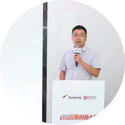
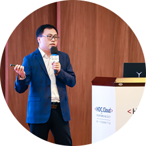

+++
title = "openGauss长沙Meetup | 共建数据库可信开源社区"
time = "2021/07/15"
date = "2021-07-15"
tags = "会议"
label = "线下"
location = "长沙"
img = "/zh/events/2021-07-15/头图.png"
img_mobile = '/zh/events/2021-07-15/头图.png'
link = "/zh/events/2021-07-15/meetup.html"
author = "openGauss"
summary = ""

+++

### 活动介绍

openGauss社区用开源的魅力吸引真正热爱技术并持续探索的用户和开发者，openGauss Meetup通过打造一个自由、活跃的前沿技术交流空间，定期邀请业内专家分享和探讨数据库领域的前瞻性技术思考与经验，共同构建一个能够融合多元化技术架构的企业级开源数据库社区。

### 活动详情

主办方：openGauss社区

合办方： 湖南省鲲鹏生态创新中心、北京海量数据技术股份有限公司、普元信息技术股份有限公司、Gauss松鼠会

时间：2021年7月15日（周四）14:00-17:20

主题：共建数据库可信开源社区

地点：湖南省长沙市岳麓区梅溪湖金茂北塔51楼城市展厅

### 会议议程：

### 演讲嘉宾：

<strong>共建openGauss可信开源社区| openGauss数据库领域总经理  胡正策 </strong>

<strong>数据库在教学中的应用与研究| 中南大学计算机学院副院长 奎晓燕</strong>

议题简介：对华为openGauss 数据库系统在高校教学中的应用进行介绍，分享将产业界的新兴自主技术有效引入高校课堂教学过程，以此提高高等学校人才培养质量。

<strong>数据库加密技术演进思路 | openGauss内核技术研发团队经理 朱金伟</strong>

议题简介：密态数据库允许客户端对客户端应用程序内的敏感数据进行加密。在查询期间，整个业务数据流在数据处理过程中都是以密文形态存在。此议题将分享数据库加密技术演讲的思路以及面临的挑战。

<strong>openGauss湖南省鲲鹏生态创新中心介绍 | 湖南省鲲鹏生态创新中心COO 旷俊</strong>

议题简介：计算产业是基础性、战略性产业，是大国竞争的制高点，与鲲鹏共展翅，昇腾九万里。此次主要分享湖南省鲲鹏生态创新中心的整体业务情况，介绍鲲鹏产业在湖南的状况。

<strong>openGauss商业版Vastbase高可用方案实践 | 海量数据研究院副院长 黄晓涛</strong>

议题简介：openGauss商业版Vastbase高可用方案实践 

<strong>普元低代码开发平台携手openGauss社区，共建科技普惠生态 | 普元信息方案研发部总监 姚斌</strong>

议题简介：普元低代码开发平台携手openGauss社区，能帮助企业IT或业务部门快速定义软件，提升软件交付效率，从而加速和深化企业数字化转型，并与openGauss共建科技普惠生态。

<strong>openGauss DB4AI 打造企业级高智能 |openGauss项目总监 蔡亚杰</strong>

议题简介：构建端到端的AI数据库自治计算平台，最小化用户的数据库运维代价，实现对数据库“自监控”、“自诊断”、“自修复”的全自治运维平台；构建基于AI自学习优化器内核，突破计划自适应选择和行数估计技术；构筑数据库内原生AI算子和全流程能力，为数据科学家极简易用计算平台。

### 报名链接

### 活动彩蛋

伴手礼：参与此次活动前100名即可获得openGauss或者Gauss松鼠会定制T恤一件

互动有礼：与讲师积极互动均还可获得《openGauss数据库核心技术》书籍一本。

抽奖有礼：本次活动设有现场抽奖环节，一等奖华为运动手表*1，二等奖华为无线耳机*2位，三等奖荣耀运动手环*3位。

<strong>希望本次活动能帮助你更加了解openGauss，融入openGauss大家庭，期待能与你相遇！</strong>