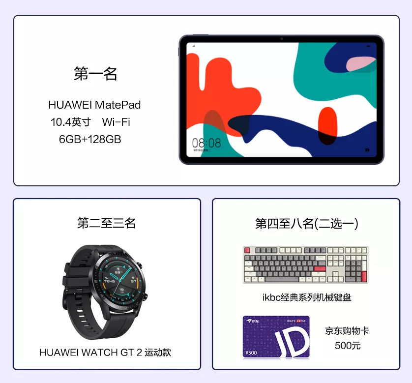
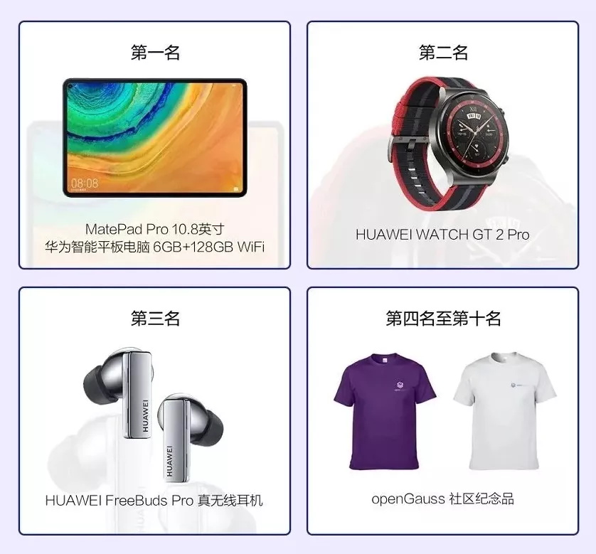

+++
title = "openGauss资料捉虫活动来袭，你准备好了吗？"
time = "2021/08/04-2021/10/31"
tags = "活动"
label = "线上"
location = "线上"
img = "/zh/events/2021-08-17/findBug_bg.jpg"
img_mobile = '/zh/events/2021-08-17/findBug_bg.jpg'
link = "./events/2021-08-17/findBug.html"
author = "openGauss"
summary = "参与openGauss资料捉虫活动，发现或解决资料中的待改进点，提交有效的问题（Issue）或修改方法（PR,Pull Request），即可赢取华为平板、手表、手环等多重礼品。"

+++

各位学习openGauss数据库的伙伴们，openGauss资料捉虫活动带着各种奖品来了！

很多同学会认为参与开源社区是技术大牛的事情，其实不然，任何人都可以参与开源项目进行贡献。只要你的提交可以提升项目质量，哪怕是一个错别字的修改都会得到肯定。

参与openGauss资料捉虫活动，发现或解决**资料中的待改进点**，提交有效的**问题**（Issue）或**修改方法**（PR，Pull Request）即可获得积分，不仅每月有机会获得机械键盘、华为手环等贡献奖，持续输出还有机会获得华为平板、华为手表等优秀奖。快来参与，让我们看到你的实力！

### **参与方式**

### 1 活动报名

**活动时间：**即日起至10月31日

**报名方式**：添加“Gauss松鼠会小助手（ID：Gauss_Asst666）”为好友，发送“**报名资料捉虫活动**”以及**码云社区用户名**，并关注“Gauss松鼠会微信公众号”，即完成报名。

### 2 提交Issue

在openGauss社区资料中寻找待改进的点，在docs仓库提交Issue反馈资料改进意见并在标题前加上【**openGauss资料捉虫活动**】标签。提交Issue的操作请参见FAQ。

- openGauss社区资料：https://opengauss.org/zh/docs/latest/docs/BriefTutorial/BriefTutorial.html

- openGauss docs仓库：https://gitee.com/opengauss/docs

### 3 提交PR

在openGauss社区资料中寻找待改进的点或对于已存在未解决的Issue问题，在Docs仓库按照提交PR修改资料并打上“**openGauss资料捉虫活动**”标签。提交PR的操作请参见FAQ。

### **活动规则**

**1.** 本次活动将根据有效的Issue或PR进行积分。

<table class="meetup20210326">
	<tr>
	    <th>序号</th>
	    <th>积分规则</th> 
	</tr>
	<tr>
	    <td>1</td>
	    <td>每提交一个Issue积 <strong>2分</strong>。 </td>
	</tr>
	<tr>
	    <td>2</td>
	    <td>提交第一个PR积 <strong>15分</strong>，后续每提交一个PR积 <strong>5分</strong>。</td>
	</tr>
	<tr>
	    <td>3</td>
	    <td>Watching和Starred docs仓库积 <strong>5分</strong>。 </td>
	</tr>
</table>

**2.** 有效的Issue或PR的评定：

-  Issue或PR已添加“**openGauss资料捉虫活动**”标签。

-  活动主办方回复为“**恭喜您！此Issue有效，感谢您的反馈**”或**PR经审核后合入到社区**表示该Issue或PR有效。

**3.** 活动针对latest版本（当前最新版本），其他版本不参与积分。

**4.** 重复问题以时间靠前的为准。

### **奖品设置**

### 参与奖

提交1个有效Issue和1个PR，即可获赠《openGauss数据库核心技术》或《openGauss数据库源码解析》书籍一本。

### 贡献奖（每月）

- 根据每月新增积分进行排名，定期在Gauss松鼠会公众号公布新增积分排行，相同积分以提交时间早者排名靠前。
  
- 贡献奖需要达到15分以上才能获奖。如果月度参与人数大于50人，则一、二、三等奖品各增加1个，四等奖增加2个。

<table class="meetup20210326">
	<tr>
	    <th>奖项</th>
	    <th>奖品明细</th> 
	</tr>
	<tr>
	    <td>一等奖</td>
	    <td>ikbc经典系列机械键盘/HUAWEI FreeBuds 4i无线耳机/京东购物卡500元</td>
	</tr>
	<tr>
	    <td>二等奖</td>
	    <td>华为手环4/HUAWEI 背包/华为智能体脂秤/京东购物卡200元</td>
	</tr>
	<tr>
	    <td>三等奖</td>
	    <td>华为三脚架自拍杆 无线版/华为耳机/京东购物卡100元 </td>
	</tr>
    <tr>
	    <td>四等奖</td>
	    <td>Gauss松鼠会定制保温杯/Gauss松鼠会文化衫/京东购物卡50元 </td>
	</tr>
</table>

### 优秀奖

根据累积积分进行排名，定期在Gauss松鼠会公众号公布累积积分排行，活动结束后（10月31日），根据总积分情况公布获奖名单。

### 双重激励

8月31日之前提交的Issue或PR同时还可以参加鲲鹏应用创新大赛·openGauss任务打榜赛，奖品包含**华为平板、手表、无线耳机**以及**openGauss社区纪念品**。

**了解详情请点击：**[鲲鹏应用创新大赛·openGauss任务打榜赛](http://mp.weixin.qq.com/s?__biz=MzkzNDE2ODg4MA==&mid=2247492708&idx=1&sn=afd7e015a213bda3007d74c61adb1fe3&chksm=c243f43bf5347d2d2a28a19fe3027475e2c119b9a8278b94fc417dbfb79e7bf6bed590ef3493&scene=21#wechat_redirect)

**月度榜奖品**

### **FAQ**

更多关于活动的常见问题请参见[资料捉虫活动指导](https://gitee.com/opengauss/docs/wikis/%E8%B5%84%E6%96%99%E6%8D%89%E8%99%AB%E6%B4%BB%E5%8A%A8%E6%8C%87%E5%AF%BC?sort_id=4292622)。

