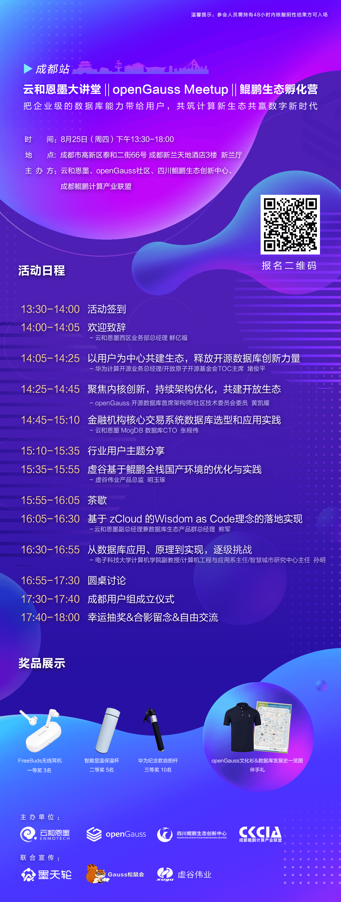

+++
title = "【成都】openGauss Meetup（8月25日）| 活动预告"
time = "2022/08/25"
date = "2022-08-25"
tags = "会议"
label = "线下"
location = "成都"
img = "/zh/events/2022-08-25/banner2.png"
img_mobile = '/zh/events/2022-08-25/banner2.png'
link = "./events/2022-08-25/meetup.html"
author = "openGauss"
summary = ""

+++

### 活动信息

主题：把企业级的数据库能力带给用户，共筑计算新生态共赢数字新时代

时间：2022年8月25日（周四）14:00-18:00

地点：四川省成都市高新区泰和二街66号 成都新兰天地酒店3楼 新兰厅 

主办方：云和恩墨、openGauss社区、四川鲲鹏创新中心、成都鲲鹏计算产业联盟

### 关于Meetup

互联网飞速发展推动数字化时代的到来，企业数字化转型迎来新的发展与机遇，数据库作为数字化的基础软件，把握技术根本、实现安全稳定是当下至关重要的问题，数据库如何保持高性能、高安全、高可用、易运维呢？企业如何选择适合当前业务需求的数据库呢？
此次活动，邀请到众多业内技术专家，从技术创新、学术创新、发展创新、以及生态共建等维度，与行业同仁共同交流开源数据库openGauss的先进技术及商业实践，探索国产数据库应用体系的无限可能，为数据库技术创新注入源源不断的活力。      

#### 活动背景：

数据库作为企业核心的重要组成部分，把握技术根本、实现安全稳定是当下至关重要的问题，国产数据库成为了企业数据库替代转型，技术创新的重要发展阵地。并且由于近几年政策利好，国产数据库市场占比逐步升高，人才不断涌入，技术快速突破。在此背景下，我们与行业同仁一起探讨国产数据库技术创新与未来发展，助力企业国产化转型发展，共同营造良好的生态环境，不断拓展技术的边界。

#### 活动详情：

此次活动成都站，我们邀请到众多业内技术专家，从技术创新、学术创新、发展创新、以及生态共建等维度，与行业同仁共同探索国产数据库应用体系，保障系统稳定性和业务连续性，推动数据库技术创新的持久发展，为国产数据库的可持续发展注入源源不断的活力，实现跨越式发展。

### 活动议程

### 温馨提示

. 因为疫情防控需要，参会的小伙伴需持有48小时内核酸阴性结果~；

. 请参会者确保14天之内未到过疫情中高风险地区或接触过疫情中高风险地区人员；

. 其他问题，请联系微信openGauss小助手:openGauss-bot
