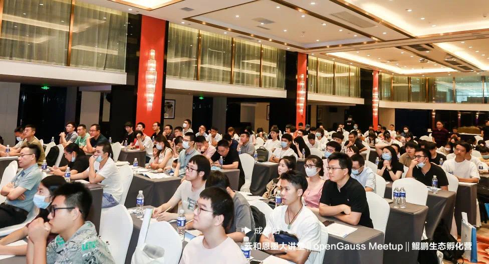
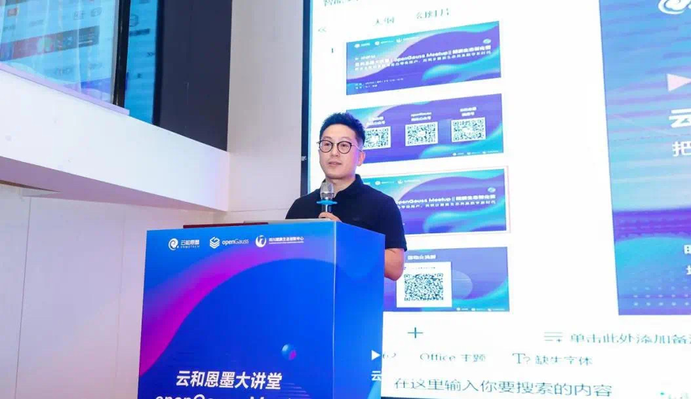
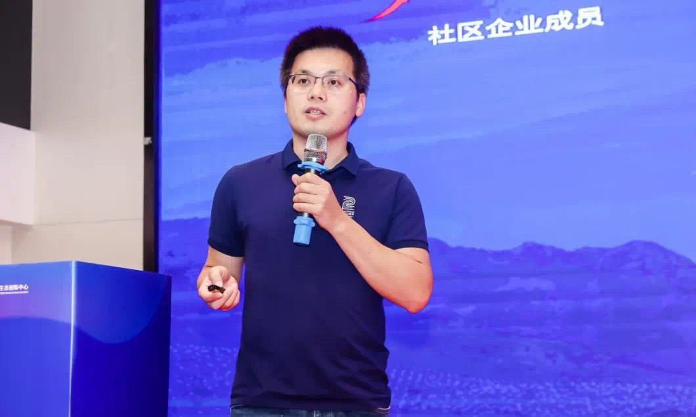
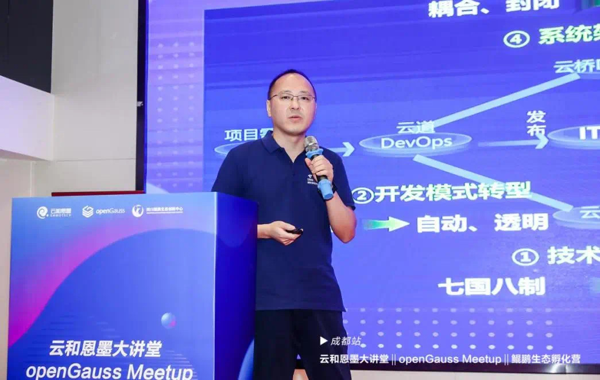
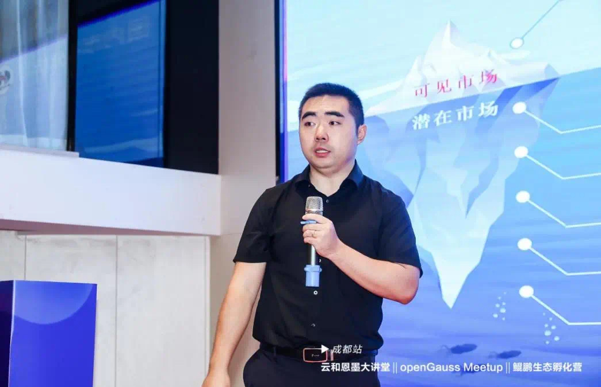
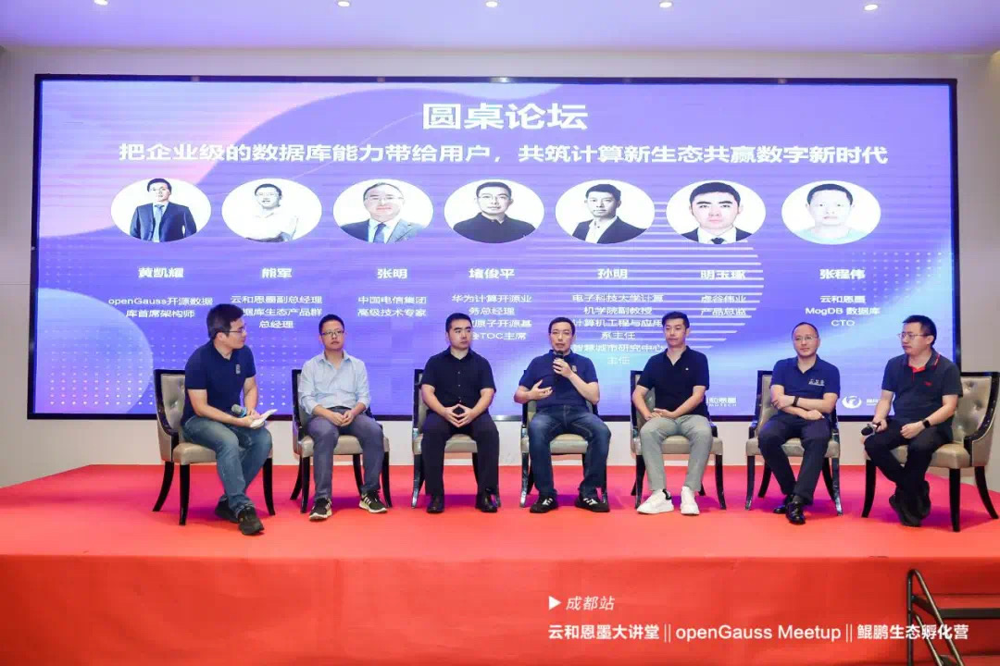
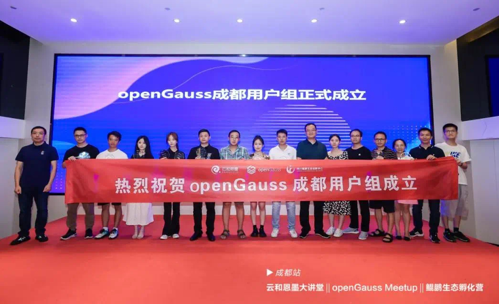

+++
title = "共筑计算新生态共赢数字新时代，云和恩墨大讲堂 x openGauss Meetup x 鲲鹏生态孵化营（成都站）圆满落幕"
time = "2022/08/26"
date = "2022-08-26"
tags = "会议"
label = "线下"
location = "成都"
img = "/zh/events/2022-08-26/banner.jpg"
img_mobile = "/zh/events/2022-02-26/banner.jpg"
link = './events/2022-08-26/meetup.html'
author = "openGauss"
summary = ""
+++

2022年8月25日，由云和恩墨、openGauss社区、四川鲲鹏生态创新中心主办的云和恩墨大讲堂 X openGauss Meetup X 鲲鹏生态孵化营在成都成功举办。此次活动以openGauss社区生态建设、内核架构创新、商业应用实践、基于鲲鹏全栈国产环境的优化与实践，数据库人才培养作为核心展开，全面展示“产学研用”正在合力共建数据库主流根社区。

本次活动共吸引了来自成都地区包括中国石油、四川省税务局、四川省大数据中心、成都铁路局、天府通、新网银行、SphereEx、神州数码、上海驻云信息科技、东方通、本原数据、四川讯方、北京超图、虚谷伟业、四川大学、电子科技大学、中国民用航空飞行学院、四川职业技术学院等30+家单位的上百名专家、开发者和用户及高校师生的积极参与，是又一次“openGauss生态全国行”的成功打卡，成都用户组也在本次活动中正式成立。

此次活动可谓大咖云集，华为计算开源业务总经理、开放原子开源基金会TOC主席堵俊平，云和恩墨西区业务部总经理鲜亿福、openGauss开源数据库首席架构师、技术委员会委员黄凯耀、云和恩墨MogDB数据库CTO张程伟、中国电信集团高级技术专家张明、虚谷伟业产品总监明玉琢、云和恩墨数据库生态产品群总经理熊军、电子科技大学计算机学院副教授、计算机工程与应用系主任、智慧城市研究中心主任孙明等领导和专家出席了本次活动，并进行了主题圆桌讨论。

**云和恩墨西区业务部总经理 鲜亿福**

云和恩墨西区业务部总经理鲜亿福在开场致辞中对大家的到来表示热烈欢迎，并由衷感谢大家在高温挑战下参加本次活动他说，“本次活动，我们与 openGauss 社区和四川鲲鹏创新中心联合，将就行业的最新解决方案、最佳客户实践和创新技术进行分享，传播技术知识，为企业的数据库能力建设和数字化转型升级助力，希望大家都能有所收获。”

**华为计算开源业务总经理、开放原子开源基金会TOC主席 堵俊平**

华为计算开源业务总经理、开放原子开源基金会TOC主席堵俊平在《以用户为中心共建生态，释放开源数据库创新力量 》的分享中指出：数字经济时代，数据是高价值生产要素，驱动着数据库的创新，开源已被广泛认可，开源数据库已成为产业共识。openGauss作为开源数据库，2020年正式开源，经过两年的发展，社区生态蓬勃发展。同时，openGauss已经在金融、运营商、政务、能源、大企业等场景进行商用实践。openGauss之所以在2年能够得到如此的发展，是因为始终坚持以用户为核心共建生态，释放开源数据库创新力量、真正为用户创造价值。

此外，堵俊平还表示：在数字化转型中，企业在使用开源软件时会遇到一系列的挑战，所以，华为2021年发起了“开源雨林”计划，广纳开源生态伙伴加入，助力企业用好开源、管好开源、贡献开源。

**openGauss开源数据库首席架构师、技术委员会委员 黄凯耀**

openGauss开源数据库首席架构师、技术委员会委员 黄凯耀在主题为《聚焦内核创新，持续架构优化，共建开放生态》中介绍到：随着越来越多开发者加入，openGauss面临的场景化挑战也与日俱增，比如安全性、开箱即用能力等。对此，openGauss将进行多个架构创新，包括面向极简迁移需求的引擎插件化架构、面向运维和预观测的内核可观测架构、面向易开发和易扩展的资源池化架构，以及数据安全架构。通过一一应对场景化挑战，提升openGauss的产品能力。

**云和恩墨MogDB数据库CTO 张程伟**

云和恩墨 MogDB 数据库CTO张程伟在《金融机构核心交易系统数据库选型和应用实践》的演讲中从数据库发展趋势及主要架构形态切入，指出了金融机构核心交易系统在替代过程中对数据库产品的安全一致、稳定可靠、性能良好、应用兼容和便捷易用等方面的严苛要求。而为更好的满足客户需求，于今年6月30日正式上线的 MogDB 3.0版本，集成 openGauss 3.0的全部特性，并融合了云和恩墨的创新特性研发，持续助力用户达成安稳易用的企业级数据环境，如全面提升数据一致性和高可用能力，事务异步提交使性能提升20%~50%，动态分区裁减实现10倍性能提升，可观测性增强，提升了维护效率等。

**中国电信集团高级技术专家 张明**

在《国产自研数据库在中国电信内部系统上云中的规模应用》的演讲中，中国电信集团高级技术专家张明指出 ：“在推动中国电信内部IT系统上云的过程中，数据库是最大挑战。”张明表示，上云涉及OLTP、OLAP等技术选择、数据迁移、SQL语法兼容性、大对象等应用改造与数据备份等方面的问题，前期规划非常重要。为应对这些挑战，四川电信使用国产自研 TeleDB 数据库支撑其内部IT系统上云，其中包含生产节点1500多个，数据量超过200TB。上云完成后，系统性能有了显著提升，其中，系统可支撑6000万用户计费出账，月处理话单450亿，API日均调用1.8亿次，响应时间毫秒级。

**虚谷伟业产品总监 明玉琢**

虚谷伟业产品总监明玉琢在《虚谷基于鲲鹏全栈国产环境的优化与实践》分享中介绍了虚谷公司与华为鲲鹏生态整合，打造国产全栈一体化解决方案，从分布式到集中式产品全面结合以实现云边端整体国产替换的诉求。

**云和恩墨副总经理兼数据库生态产品群总经理 熊军**

除了数据库 MogDB, 云和恩墨的生态工具产品也做到了行业领先。“数据库用得好不好，除了数据库本身的功能和质量，运维管理是一个重要的环节。公司的数据库云管平台 zCloud 为用户提供了高效的运维能力。”云和恩墨副总经理兼数据库生态产品群总经理熊军在《基于 zCloud 的Wisdom as Code理念的落地实现》演讲中指出，“管理的核心要素是最佳实践，而最佳实践又来源于经验。”他强调，Wisdom as Code理念是用代码将经验内化到系统中并不断迭代。

**电子科技大学计算机学院副教授、计算机工程与应用系主任、智慧城市研究中心主任 孙明**

电子科技大学计算机学院副教授、计算机工程与应用系主任、智慧城市研究中心主任孙明发表题为《从数据库应用、原理到实现，逐级挑战》演讲表示：电子科技大学作为国内首批在数据库教学过程中融入openGauss的高校之一，目前构建了从应用、原理到实现，逐级挑战的数据库教学体系。整个数据库课程体系深度融入openGauss，培养学生从数据库的使用者、开发者，逐步成长为设计者和实现者。

**圆桌论坛**

在圆桌讨论环节，主持人黄凯耀与前面六位演讲嘉宾围绕“把企业级的数据库能力带给用户，共筑计算新生态共赢数字新时代”的主题，探讨了开源对当前软件行业以及数据库行业的影响，openGauss 系数据库应从哪些方面提升竞争力，如何培养适合未来软件以及数据库行业的教育人才，鲲鹏产业以及数据库产业的未来发展等话题，从多个角度为观众剖析了openGauss数据库生态建设与发展路径。

**成都用户组成立仪式**

在本次活动的最后环节，openGauss 成都用户组（openGauss User Group，简称oGUG）正式成立，共吸引了十三家企业代表加入。他们未来将依托成都用户组，积极参与openGausa技术布道家交流、分享数据库知识和实践方案，持续为 openGauss社区发展贡献力量。

openGauss User Group，简称oGUG，是一个让开发者就openGauss技术特性、最佳实践、运营进展等方向交流的公益性本地社区。oGUG由Organizer 、Member、Ambassador三种角色构成:

.Organizer：整体统筹和规划发展方向及计划，并跟进与把控整体进度。

.Member：根据运营计划，配合oGUG的日常运营，以用户身份积极参加活动，产出技术内容，积极推广openGauss。

.Ambassador：通过布道的方式帮助他人了解或使用openGauss，并代表用户优化产品体验，增进其他用户对openGauss的了解。

**openGauss成都用户组首批成员分别是：**

. Organizer  曾强 四川鲲鹏生态创新中心

. Ambassador  俞翔 泰克教育 

. Ambassador  黄元霞 虚谷伟业 

. Ambassador  李真旭 云和恩墨 

. Member   佘兴彬 云和恩墨

. Member   陈少云 云和恩墨

. Member   杨明翰 云和恩墨

. Member   王涛 云和恩墨 

. Member   熊小红 海量数据

. Member  孙久江 海量数据

. Member  熊小红 海量数据

. Member  甘丽 本原数据

. Member  陈泽 本原数据

. Member  窦尧 兴业数字金融

. Member  胡娟 兴业数字金融

. Member  刘牌 东方通

. Member  熊灿灿 平安科技

. Member  贺胜 个人开发者

. Member  江龙滔 北京思斐软件

. Member  陈智明 成都海迪鑫华

云天收夏色，木叶动秋声。在大家的热情参与和积极支持下，本次成都站活动取得圆满成功。接下来，openGauss将在更多次全国生态行活动中与更多地区的开发者、用户、高校师生见面进行技术探讨与交流，敬请期待！

更多现场精彩，请点击：<https://live.photoplus.cn/live/53325932?uniqCode=Uv7awWgz2V&accessFrom=qrcode&state=STATE&code=031gKlFa1TiaND0GOKHa16h0Bt0gKlF-#/live>

