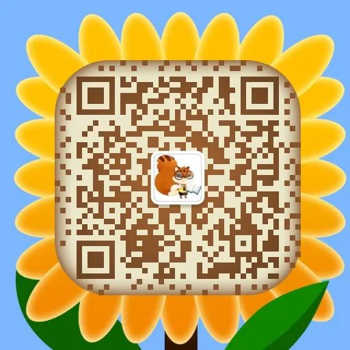
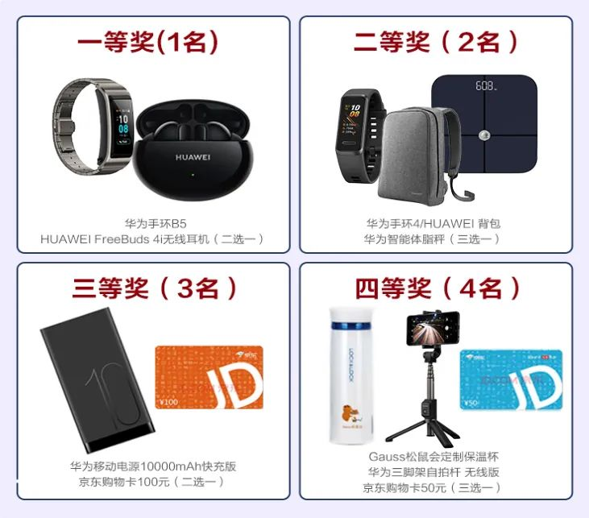
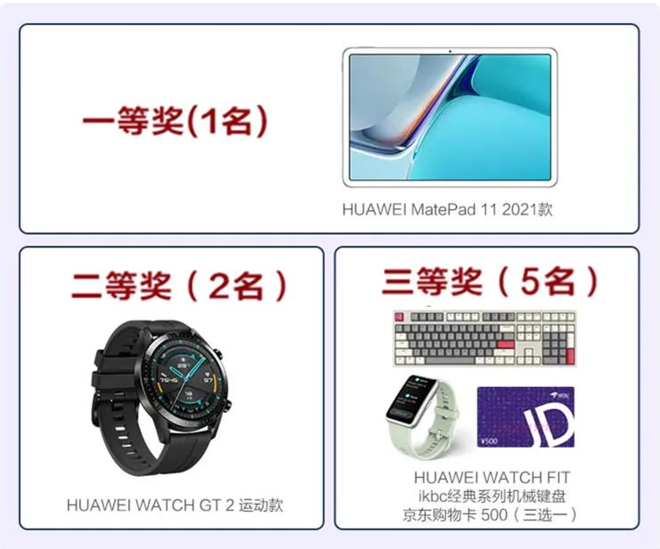

+++
title = "第二届【openGauss资料捉虫】活动来袭，你准备好了吗？"
time = "2022/09/01-2022/10/31"
tags = "活动"
label = "线上"
location = "线上"
img = "/zh/events/2022-09-05/pc_banner_bug.jpg"
img_mobile = "/zh/events/2022-09-05/mobile_banner_bug.png"
link = '/zh/events/2022-09-05/findBug.html'
author = "openGauss"
summary = "参与openGauss资料捉虫活动，发现或解决资料中的待改进点，提交有效的问题（Issue）或修改方法（PR,Pull Request），即可赢取华为平板、手表、手环等多重礼品。"
+++

为让更多的朋友了解、参与到 openGauss 开源社区建设中，并持续提升 openGauss 资料质量，Gauss 松鼠会联合 openGauss 社区、鲲鹏社区、墨天轮共同开展第二届 openGauss 资料捉虫活动！

报名参与 openGauss 资料捉虫活动，发现或解决资料中的待改进点，或者推荐他人参与活动，均有机会获奖。

参与活动的伙伴不仅每月有机会获得**华为无线耳机、华为手环**等月度贡献奖，持续输出还有机会获得**华为平板、机械键盘**等优秀贡献奖。快来参与，让我们看到你的实力！

### 【参与方式】

### 1. 活动报名

**活动时间：** 即日起至 10 月 31 日

**报名方式：** 添加“Gauss 松鼠会小助手（ID：Gauss_Asst666）”为好友，发送“ **报名资料捉虫活动** ” 以及 Gitee 用户名，即完成报名。

### 2. 参与活动

### 方式一：直接参与社区贡献

-   1.提交有效问题（Issue）:

    在 openGauss 社区资料中寻找待改进的点，在 docs 仓库提交 Issue 反馈资料改进意见并在标题前加 **【openGauss 资料捉虫活动】** 标签。操作指导请参见： <https://gitee.com/opengauss/docs/blob/master/contribute/OperationGuide/%E6%8F%90%E5%87%BA%E5%86%85%E5%AE%B9%E6%94%B9%E8%BF%9B%E6%84%8F%E8%A7%81.md>

-   2.提交有效修改方法（PR,Pull Request）:
    在 openGauss 社区资料中寻找待改进的点或对于已存在未解决的 Issue 问题，在 docs 仓库按照提交 PR 修改资料并在标题前加 **【openGauss 资料捉虫活动】** 标签。操作指导请参见：<https://gitee.com/opengauss/docs/blob/master/contribute/OperationGuide/%E8%B4%A1%E7%8C%AE%E6%96%87%E6%A1%A3.md>

### 方式二：推荐他人参与社区贡献

-   1.受邀者完成“openGauss 资料捉虫活动”报名并发送邀请者微信昵称给 Gauss 松鼠会小助手。

-   2.受邀者在 openGauss 社区 **提交有效问题（Issue）和修改方法（PR,Pull Request）**。

### 【奖品设置】

#### 参与奖

提交 1 个有效的 Issue 和 1 个有效的 PR，即可获赠华为官方出版的《openGauss 数据库核心技术》、《openGauss 数据库实战指南》或《openGauss 数据库源码解析》书籍一本。

#### 推广奖

每邀请 2 个 openGauss 社区新用户，且受邀请人成功提交 1 个有效的 Issue 和 1 个有效的 PR，邀请人即可获赠以**下奖品之一**。同一邀请人最多可获得 5 份礼品。

### 贡献奖（月度）

根据每月新增积分进行排名，定期在 Gauss 松鼠会公众号公布月度积分排行。贡献奖需要达到 30 分以上才能获奖。**如果月度参与人数大于 50 人，则一、二、三等奖品各增加 1 个，四等奖增加 2 个**。

### 优秀贡献奖

根据累积积分进行排名，活动结束后（10 月 31 日），根据总积分情况公布获奖名单。

注：

-   1.推广奖与月度贡献奖、优秀贡献奖相互独立，每位参与活动者获奖可叠加。
-   2.奖品种类数量有限，先到先得。
-   3.所有获奖者需在鲲鹏社区完成实名认证后方可领取奖品。

### 【活动规则】

本次捉虫活动采用积分制，包含如下 2 部分积分：

-   邀请好友参与活动，获得相应的积分：
    每成功邀请一个 openGauss 社区新用户（未参与过 openGauss 社区贡献），且受邀人提交 1 个有效 Issue 和 1 个有效的 PR，邀请人即可获得 20 积分，积分依次累加。
-   对有效的 issue 和 PR 进行积分：

<table class="meetup20210326">
	<tr>
	    <th>项目</th>
	    <th>积分规则</th>
	</tr>
	<tr>
	    <td>Issue</td>
	    <td> </td>
	</tr>
	<tr>
	    <td>PR</td>
	    <td>提交第一个PR积 <strong>6分</strong>，后续每提交一个PR积 <strong>2分</strong>。</td>
	</tr>
</table>

### 附录

有效的 Issue 或 PR 的评定：

-   Issue 或 PR 已添加“openGauss 资料捉虫活动”标签。

-   如果是低错类问题，每个 Issue/PR 中至少需要包含 3 处以上错误：

    <table class="meetup20210326">
      <tr>
          <th>问题类型</th>
          <th>包含但不限于以下</th>
      </tr>
      <tr>
          <td>规范问题或低错</td>
          <td>
    错别字或拼写错误；标点符号使用错误 
    链接错误、空单元格、格式错误 
    英文中包含中文字符 
    表述不通顺，但不影响理解 
    版本号不匹配：如软件包名称、界面版本号 
    上下文描述不一致
          </td>
      </tr>
      <tr>
          <td>易用性问题</td>
          <td>
          关键步骤错误或缺失，无法指导用户完成任务 
    缺少必要的前提条件、注意事项等 
    描述存在歧义
    </td>
      </tr>  
    </table>

-   活动主办方回复为“ **恭喜您！此 Issue 有效，感谢您的反馈** ”或 **PR 经审核后合入到社区**表示该 Issue 或 PR 有效。

-   活动针对 latest 版本（当前最新版本），其他版本不参与积分。

-   重复问题以时间靠前的为准。

### 常见问题：

**Q1：自己提的 Issue 被别人提了 PR，算违规吗？**

A1：在开源社区，大家可以自由的提交 Issue 和 PR，都是在为开源社区做贡献，没有违规一说。由于本次是在举办活动，有其特殊性，原则上鼓励并提倡大家针对自己的 Issue 自己提交 PR 解决。如果 Issue 提交超过 12 小时后仍未解决，则其他人针对此 Issue 提交的 PR 有效。

**Q2：如果我和其他人提交了相同的 Issue 或 PR，我提交的时间早，但是先合入了另一个人的 PR 导致冲突，积分怎么算？**

A2：理论上来说先提交 Issue 和 PR 的会先合入。但如果后提交的人的 PR 和 Issue 先合入了，也会是先提交的 Issue 和 PR 积分有效。

**Q3：同一个文件中的相同问题，拆成多个 Issue 和 PR，这个积分怎么算呢？**

A3：本次活动旨在让大家在开源社区上贡献，重在发现问题，建议大家同一个页面的问题提交一个 Issue。

**Q4：如果出现相同积分，如何进行排名？**

A4：积分相同的情况下，以个人最后一个提交早者排名靠前。
