+++
title = "云和恩墨大讲堂 x openGauss Meetup x 鲲鹏生态孵化营(上海站）圆满落幕"
time = "2022/09/19"
date = "2022-09-19"
tags = "会议"
label = "线下"
location = "上海"
img = "/zh/events/2022-09-19/banner.jpg"
img_mobile = "/zh/events/2022-09-19/banner.jpg"
link = './events/2022-09-19/meetup.html'
author = "openGauss"
summary = ""
+++

2022年9月16日，由云和恩墨、openGauss社区、上海鲲鹏生态创新中心联合主办的云和恩墨大讲堂 x openGauss Meetup x 鲲鹏生态孵化营在上海成功举行。此次活动以技术创新、学术创新、以及生态共建等维度，与大家共同交流开源数据库openGauss的技术能力及商业实践，把企业级的数据库能力带给用户，共筑计算新生态，共赢数字新时代。

出席此次活动的领导和嘉宾有云和恩墨创始人兼总经理，中国DBA联盟理事长，鲲鹏MVP，openGauss社区理事盖国强、华为计算开源开发与运营部总监李永乐、复旦大学计算机科学技术学院教授，博士生导师王鹏、云和恩墨副总经理兼区域客户群总经理朱承廉、上海鲲鹏生态创新中心COO张中阳、中国太平洋人寿保险股份有限公司，资深架构师陆进 、华为高级研发工程师，openGauss数据库内核Committer熊小军、云和恩墨东区行业架构中心总经理胡自贵、云和恩墨高级研究员刘伟。

**本次活动共吸引了来自上海地区30+家单位的50名专家、开发者和用户的积极参与，上海用户组在本次活动中正式成立。**

**云和恩墨副总经理兼区域客户群总经理朱承廉首先作了开场致辞，对来到现场参会的观众和演讲嘉宾表示热烈欢迎。**他谈到，数据库经历了六十年波澜壮阔的发展，国产数据库也从艰难起步到现在的百花齐放，在这一段快速发展变化的历程里，「云和恩墨大讲堂」这一品牌活动已经持续做了十年，举办了数百场线上线下活动，始终坚持不断地将行业热点、技术创新和最佳实践分享给大家。朱承廉表示：“今天的技术分享活动将就数据库行业正在进行的变革和未来发展的趋势，以及国产数据库的新技术、新生态，跟大家进行深入的探讨，希望大家都能有所收获。”

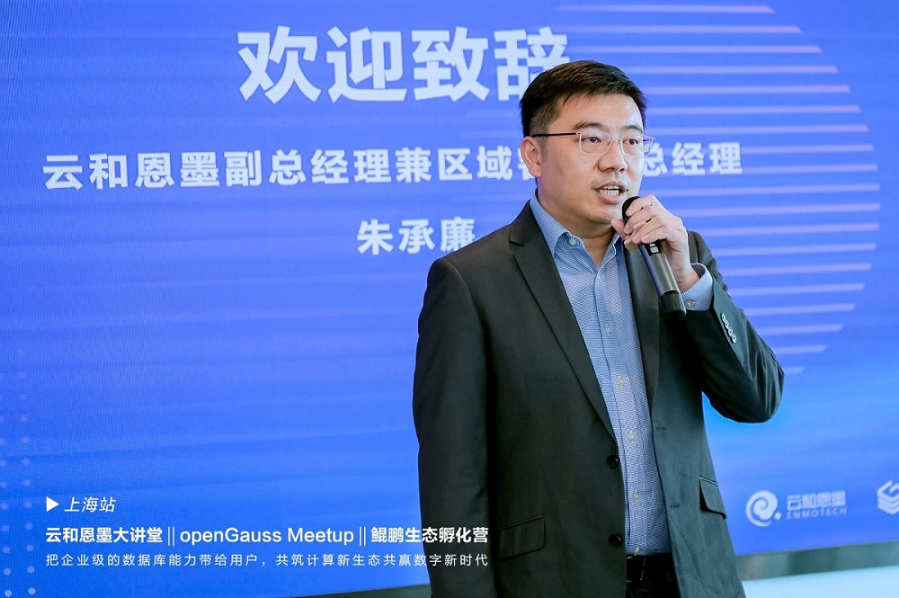

**云和恩墨副总经理兼区域客户群总经理 朱承廉**

**华为计算开源开发与运营部总监李永乐在《以领先的企业级数据库为基础，持续创新共赢未来》主题中**分享了openGauss做为领先的企业级开源关系型数据库，之所以能取得快速发展是因为在社区治理上采取开放透明的多层治理架构，产品竞争力上不断扩大创新广度和深度，并始终坚持以用户为核心共建生态，释放开源数据库创新力量，真正为用户创造价值。

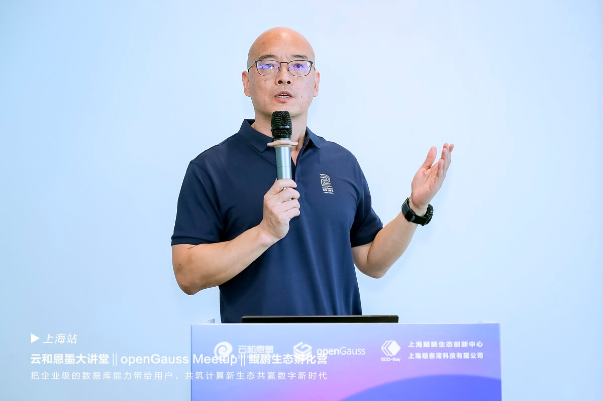

**华为计算开源开发与运营部总监 李永乐**

那么作为社区领先的合作者与贡献者，云和恩墨持续深耕数据技术，也在不断坚持创新突破。在数据库领域的后发者，如何才能打破传统商业数据库积累了数十年的技术优势，实现引领超越呢？**云和恩墨创始人兼总经理、中国DBA联盟理事长、鲲鹏MVP盖国强在演讲中表示：“未来的数据库一定都是开源的，只有产业链中的参与者协同发挥自身优势，广纳贤才共同投入到数据库的建设中来，形成合力集中攻关加速突破，才能加速国产数据库发展成熟。”**云和恩墨致力于帮助行业用户平稳达成国产化替代升级，并打造全生命周期的智能化管理。“企业级数据库 MogDB +数据库云管平台 zCloud”的组合承蒙来自金融、电信、制造、运输、政务等行业头部用户的信任，经历实际业务场景的重重锤炼，不断进行迭代升级、开拓创新，沉淀出“安稳易用、自治智能”的产品能力。

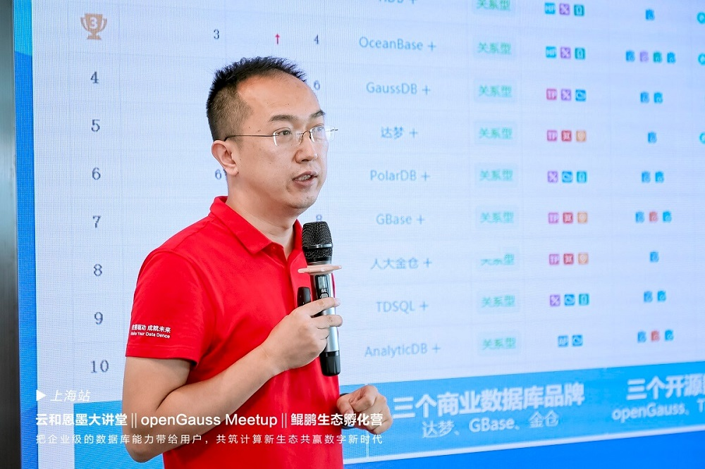

**云和恩墨创始人兼总经理，中国DBA联盟理事长，鲲鹏MVP，openGauss社区理事 盖国强**

**华为高级研发工程师、openGauss数据库内核Committer熊小军在主题为《聚焦内核创新，持续架构优化》**中介绍到：随着越来越多开发者加入，openGauss面临的场景化挑战也与日俱增，对此，openGauss进行了多个架构创新，包括面向极简迁移需求的引擎插件化架构、面向运维和预观测的内核可观测架构、面向易开发和易扩展的资源池化架构，以及数据安全架构，通过一一应对场景化挑战，提升openGauss的产品能力。

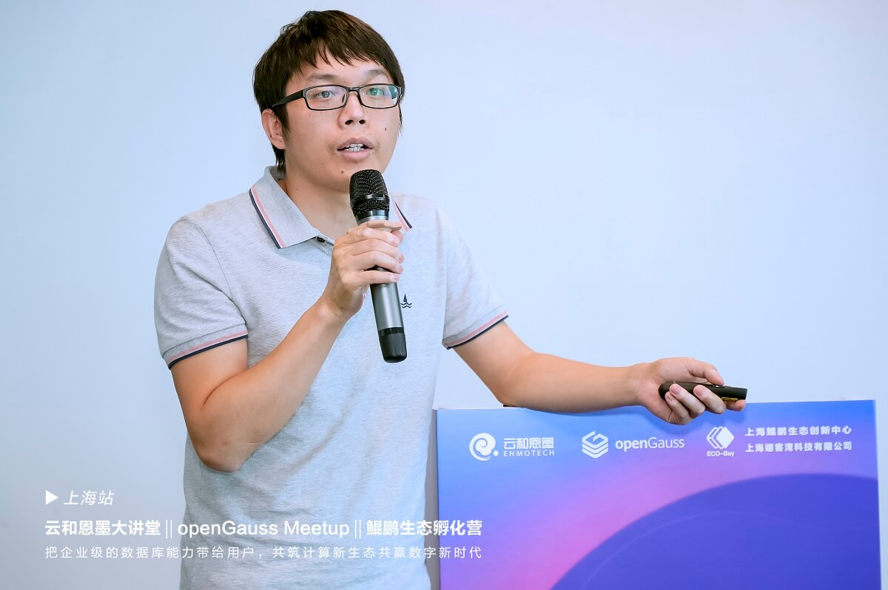

**华为高级研发工程师、openGauss数据库内核Committer 熊小军**

在国产化改造的进程中，金融机构对数据库系统的能力提出了更为严苛的要求。由于它们的核心业务系统支撑着大量交易业务，所以要求数据库产品在安全一致、稳定可靠、性能、兼容性和便捷易用等方面的能力要达到相较于其他行业更高的标准。**云和恩墨高级研究员、数据库内核研发工程师刘伟向我们介绍到，云和恩墨主打“安稳易用”的数据库产品 MogDB，在今年6月发布的3.0版本中更新了多项关键特性**，如全面提升数据一致性和高可用能力、事务异步提交使性能提升20%~50%、动态分区裁减实现10倍性能提升等，这些都能够满足金融行业的极致性能要求。另外，他还通过几个案例阐述到：“对于数据库系统的迁移替代也是丝毫不用担心的，MogDB 配备了迁移异构数据库的全套工具，能够完整覆盖迁移过程中的评估、改写、数据迁移和验证工作，有效提升迁移成功率并降低迁移成本，保障数据库系统的平稳迁移。”

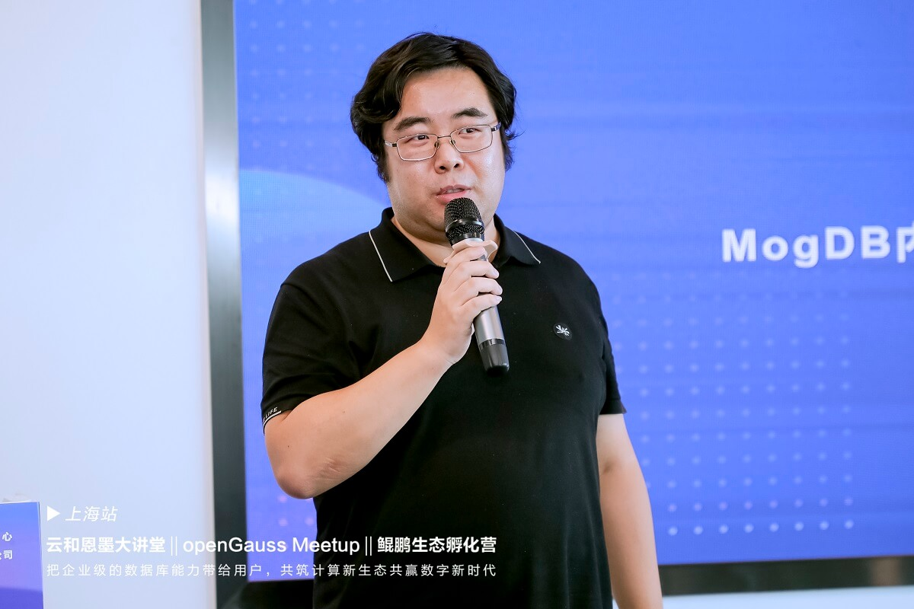

**云和恩墨高级研究员、openGauss SIG SQL Committer 刘伟**

**来自中国太平洋人寿保险股份有限公司的资深架构师陆进紧接着金融行业国产数据库选型这一话题，分享了中国太保在国产数据库转型过程中宝贵的数据库选型经验。**该公司在为期三年的规划与实施中，形成了完备的考量因素并进行了全面的POC测试。他特别强调：“在国产数据库选型测评中，迁移工具的功能完整性、性能及准确性也极其重要，这决定了数据库能否完整、平稳地进行数据迁移和业务过渡。”陆进站在行业用户的角度，深刻阐述了数据库厂商在产品能力建设和服务体系建设、国产数据库规划与设计要点、应用及数据迁移要点等方面的重要性。这对于厂商和计划使用国产数据库的用户都有借鉴意义。经历了长时间的选型调研、改造方案设计，陆进也有了自己对于国产数据库行业的感悟，他说：“‘独行速、众行远’，培养一个生态需要长期的规划和持续的投入，要想让国产数据库技术能力不断创新、达到更高水平，一定是需要产业链上的所有合作伙伴共同努力的。”
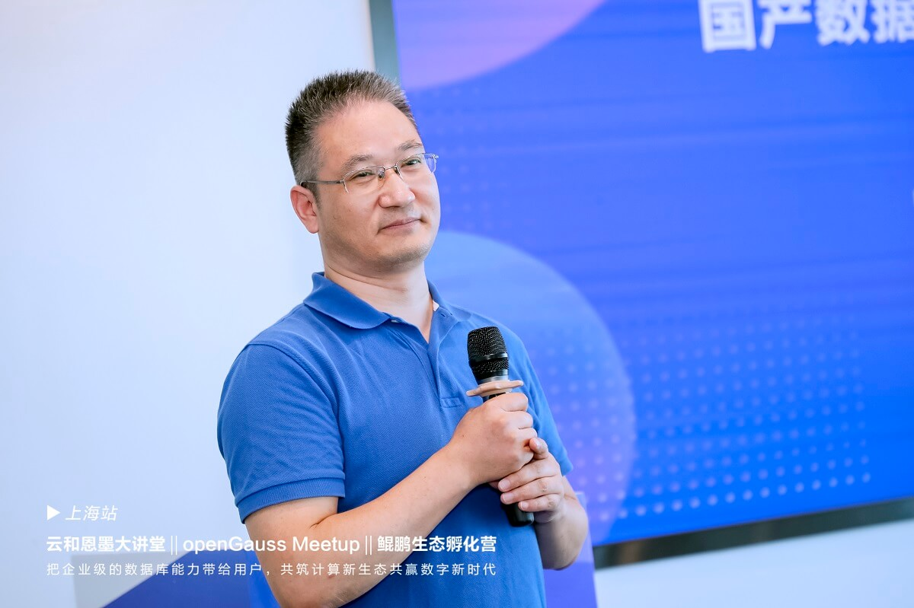

**中国太平洋人寿保险股份有限公司深架构师 陆进**

**复旦大学计算机科学技术学院教授，博士生导师王鹏为我们带来《工业数据管理和分析中的挑战和技术》的主题分享。**时序数据管理和分析是工业大数据处理的重要环节，现有时间序列数据库主要支持数据快速读写和简单聚集查询，通用时序分析工具主要关注预测和异常检测等简单分析功能，领域时间序列分析工具支持更丰富的分析手段，但不具有数据库能力，且无法支持通用时序分析。本次报告以时序工况切分、相似性查询、关联分析、异构数据查询等为例，介绍了工业大数据处理中的典型分析和复杂查询场景，以及对于时序数据库的挑战。然后介绍了团队在工业时间序列管理和分析系统方面的若干探索工作。
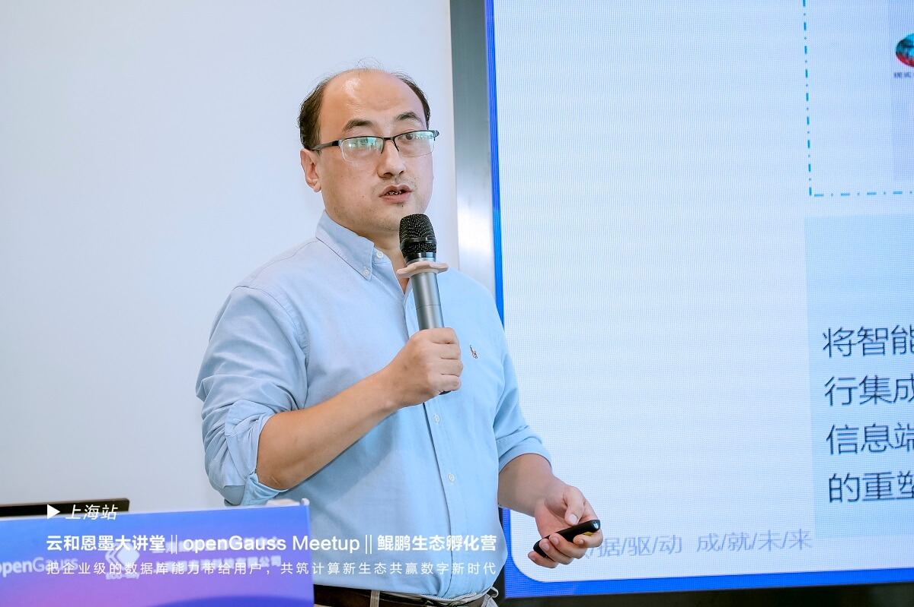

**复旦大学计算机科学技术学院教授，博士生导师 王鹏**

企业已步入了多元异构数据库时代，如何构建安全、稳定、连续、高效的数据库环境，夯实企业数字化底座，为企业数字化转型获得先机，如何更好地助力企业业务发展，是我们需要共同面对的挑战！**云和恩墨东区行业架构中心总经理胡自贵在本次活动的分享中指出，不管是选择哪种数据库，对于企业而言，最终的目标是构建“一支撑（技术）、双引擎（团队、平台）”的数据库服务能力体系，**实现数据库运维的标准化、自动化、集中化、智能化。那如何去构建这个服务能力体系，他提出了构建数据库云化架构（dbPaaS）的解决方案，遵循“开放兼容”的原则，要兼顾存量和新增的业务需求，从“层次化数据库承载层规划与建设、标准化数据库资源池规划与建设、规范化数据库运维管理制度制定、自动化数据库环境统一运维管控、前置化SQL审核和质量管控机制、专业化数据库全生命周期运维保障”这六个方面来展开，结合企业的实际情况灵活设计、分阶段推进，覆盖企业开发测试、生产运行、运维保障三大业务场景，最终实现“标准、自动、敏捷、智能”的目标。

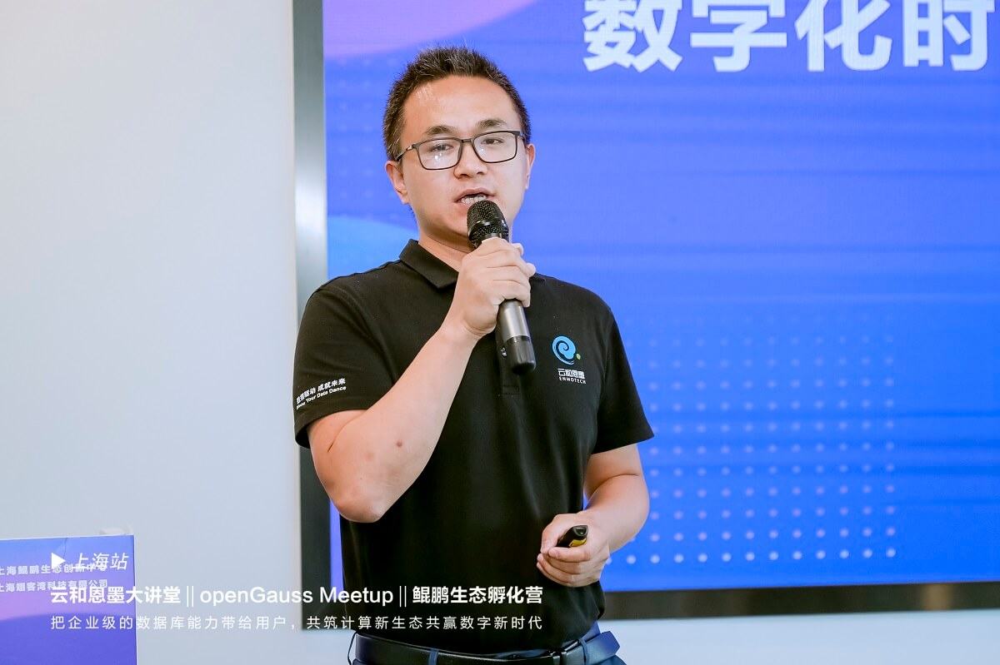

**云和恩墨东区行业架构中心总经理 胡自贵**

除了嘉宾分享之外，本次活动还设置了圆桌论坛。在圆桌讨论环节，六位嘉宾——盖国强、李永乐、陆进、王鹏、胡自贵、熊小军共同围绕“把企业级的数据库能力带给用户，共筑计算新生态共赢数字新时代”的主题，探讨了各自对于“开源对当前软件行业以及数据库行业的影响”的看法，并就“openGauss 系数据库应从哪些方面提升自身竞争力”“应该如何培养适合未来软件及数据库行业的人才”“鲲鹏产业以及数据库产业的未来发展”等话题进行了充分的交流，从不同的角色和角度表达观点，为观众剖析了国产数据库蓬勃发展的建设思想和发展路径。

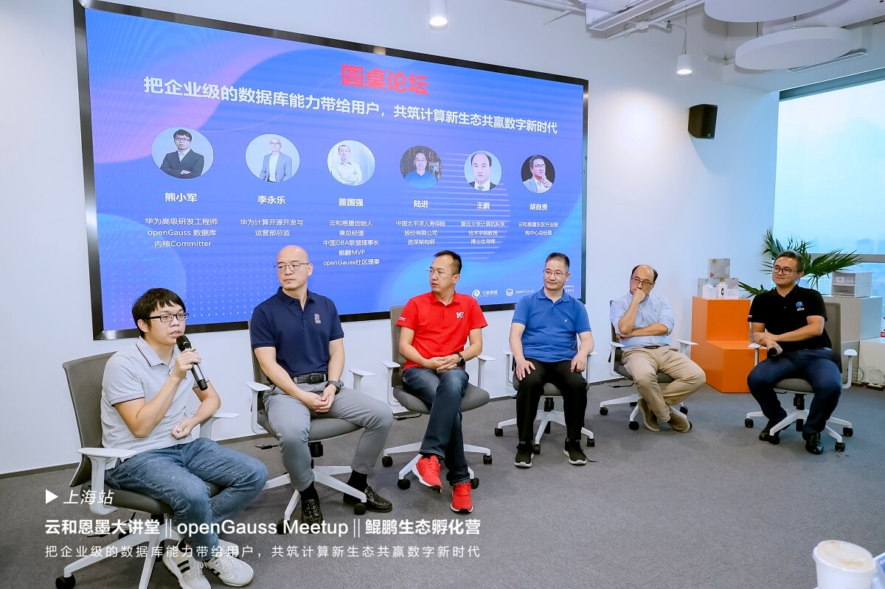

**圆桌论坛**

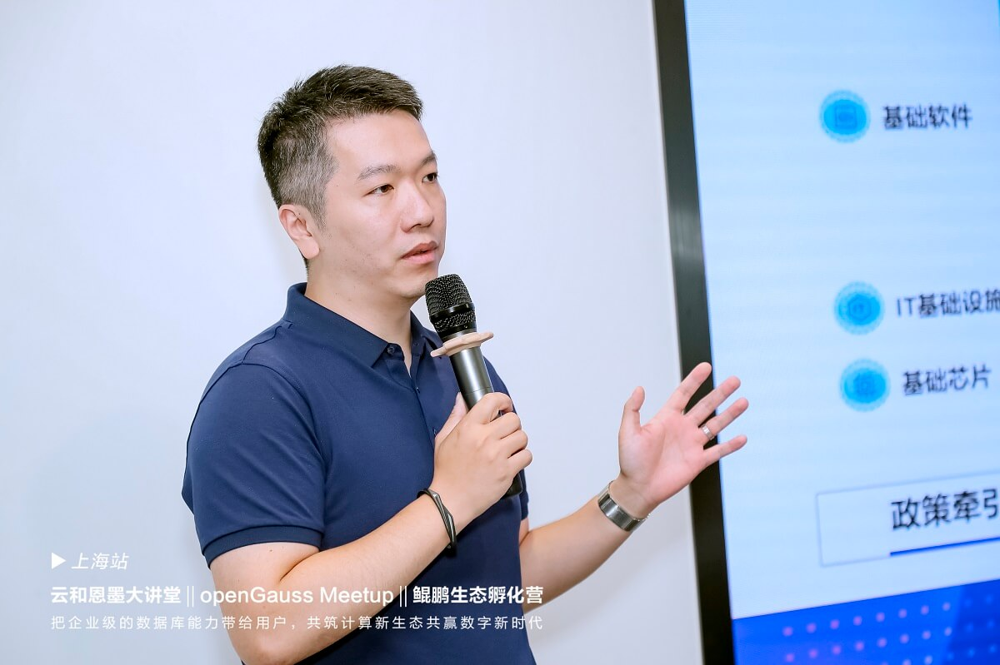

**上海鲲鹏生态创新中心COO 张中阳**

活动的最后环节，**上海鲲鹏生态创新中心COO张中阳为大家介绍了上海鲲鹏生态创新中心以及openGauss上海用户组，作为上海用户组的Organizer，在他的主持下，openGauss 上海用户组正式成立。**首批吸引了九家企业代表踊跃加入，他们未来将依托上海用户组，积极参与openGauss技术布道以及行业交流、分享数据库知识和实践方案，持续为 openGauss社区发展贡献力量。

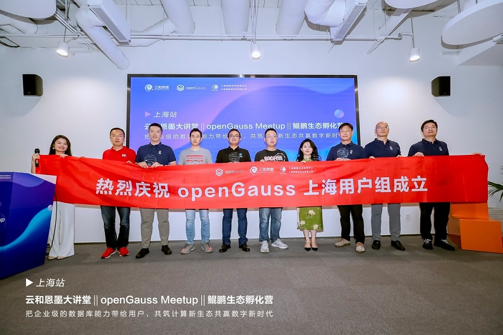

**上海用户组成立**

openGauss User Group，简称oGUG，是一个让开发者就openGauss技术特性、最佳实践、运营进展等方向交流的公益性本地社区。oGUG由Organizer 、Member、Ambassador三种角色构成:

.Organizer：整体统筹和规划发展方向及计划，并跟进与把控整体进度。

.Member：根据运营计划，配合oGUG的日常运营，以用户身份积极参加活动，产出技术内容，积极推广openGauss。

.Ambassador：通过布道的方式帮助他人了解或使用openGauss，并代表用户优化产品体验，增进其他用户对openGauss的了解。

**openGauss上海用户组首批成员分别是：**

. Organizer  张中阳 上海鲲鹏生态创新中心

. Ambassador  宋少华 个人开发者

. Ambassador  刘长浩 民生银行 

. Ambassador  刘天顺 润和软件信息技术有限公司

. Ambassador  李华 云和恩墨

. Member   李欧 浪潮软件

. Member   明珠禧梅 海量数据

. Member   王钰 海量数据

. Member   周游 鹰图软件技术（青岛）有限公司 

. Member   姚昕 上交所技术有限责任公司

. Member  田介 信元公司

. Member  胡自贵 云和恩墨

. Member  黄晶 海量数据

. Member  谢金融 云和恩墨

. Member  窦尧 兴业数字金融

. Member  胡娟 兴业数字金融

. Member  刘牌 东方通

. Member  熊灿灿 平安科技

. Member  贺胜 个人开发者

. Member  江龙滔 北京思斐软件

. Member  陈智明 成都海迪鑫华

秋高气爽，丹桂飘扬，openGauss怀揣着未来，播撒着希望，走过又一城。感恩所有开发者和用户的热情参与和支持，我们下次再会！

