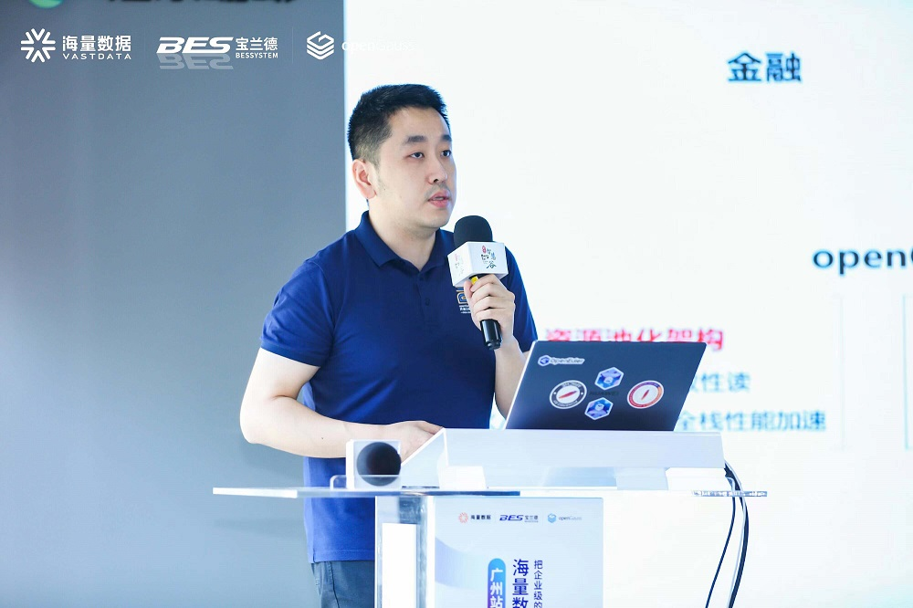
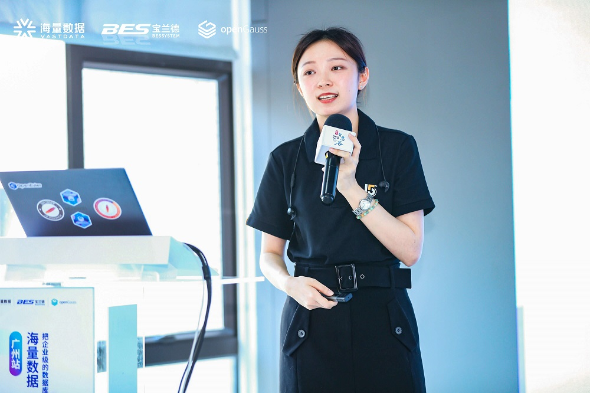
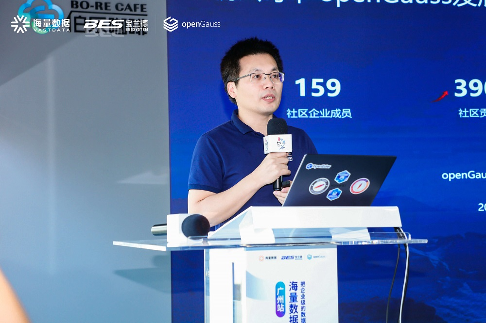
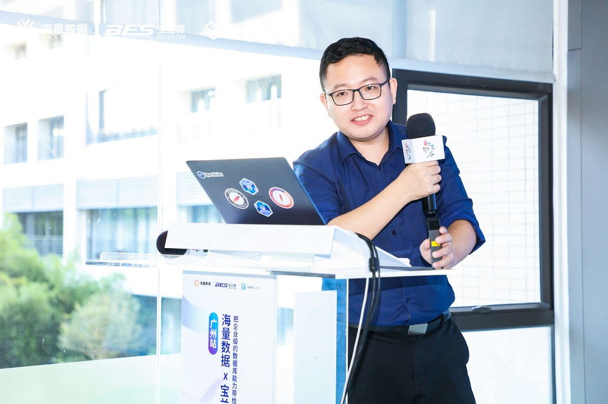
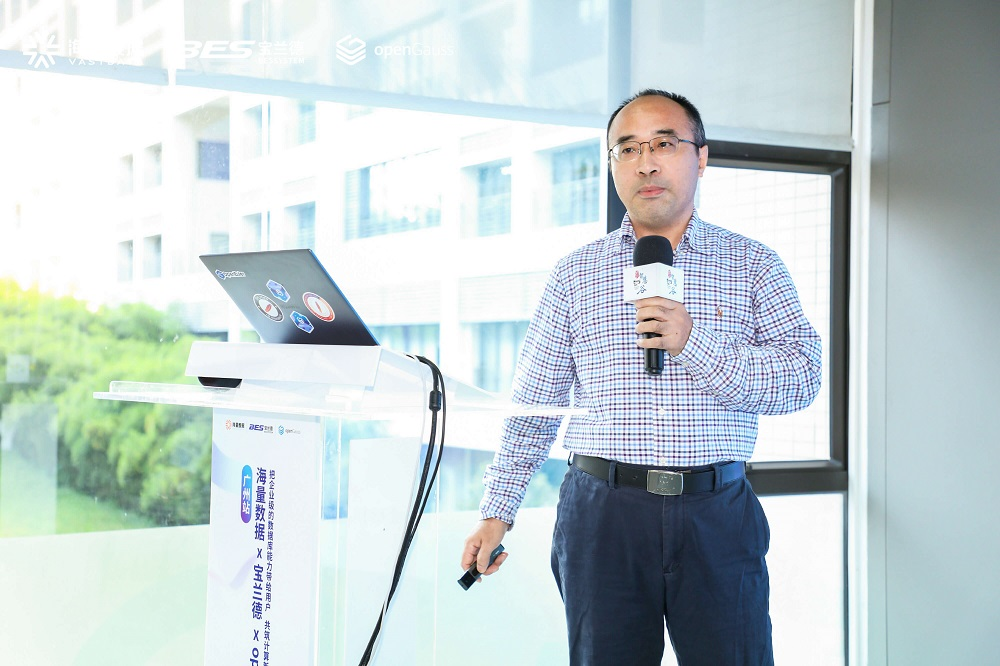
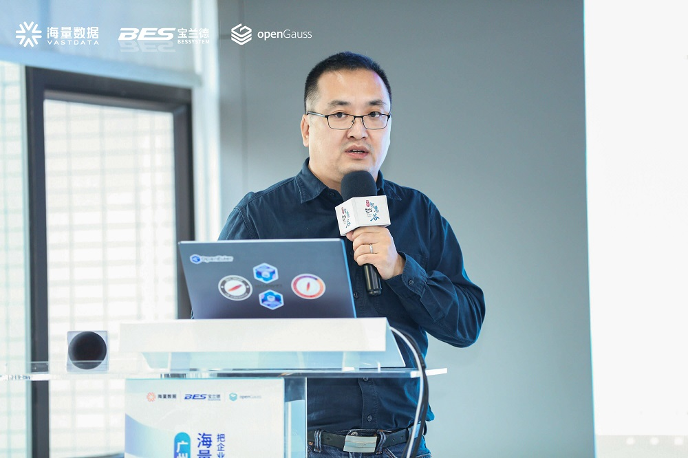
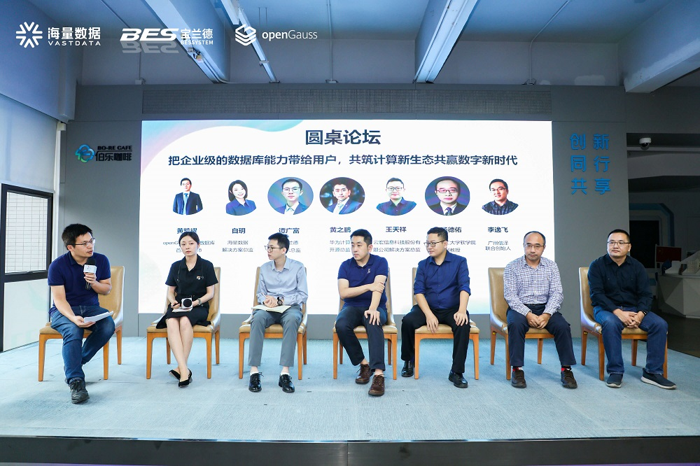
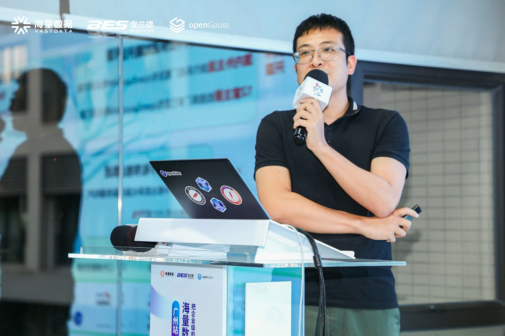
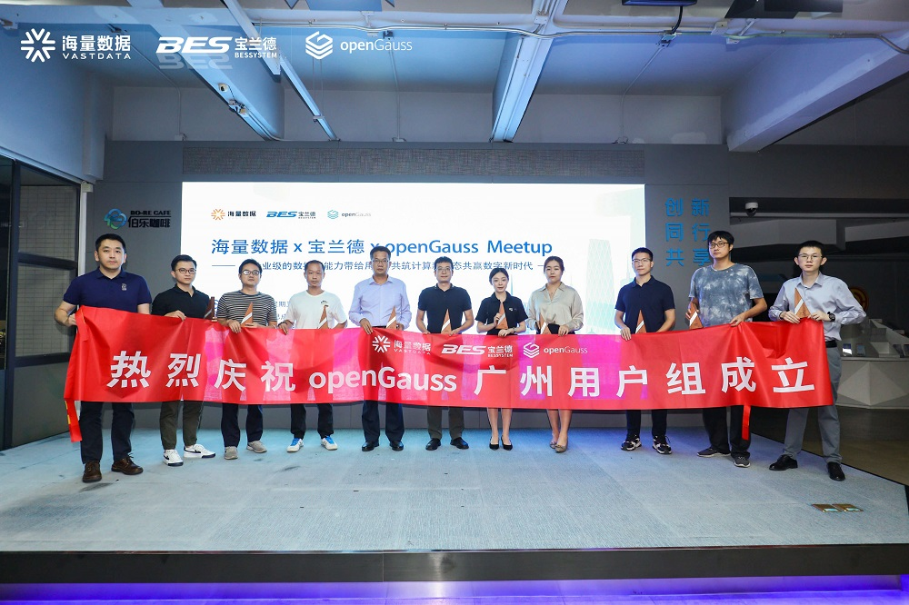

+++
title = "海量数据 x 宝兰德 x openGauss Meetup成功举办，广州用户组正式成立！"
time = "2022/10/24"
date = "2022-10-24"
tags = "会议"
label = "线下"
location = "广州"
img = "/zh/events/2022-10-24/banner.jpg"
img_mobile = "/zh/events/2022-10-24/banner.jpg"
link = './events/2022-10-24/meetup.html'
author = "openGauss"
summary = ""
+++

2022年10月21日，由海量数据、宝兰徳、openGauss社区联合主办，广州市天河区信创联盟协办的海量数据 x 宝兰德 x openGauss Meetup在广州成功举行。此次活动从技术创新、学术创新、发展创新、以及生态共建等维度，与大家共同探讨数据库应用体系建设，保障系统稳定性和业务连续性，把企业级的数据库能力带给用户，共筑计算新生态，共赢数字新时代。

**本次活动共吸引了来自上海地区30+家单位的50名专家、开发者和用户的积极参与，上海用户组在本次活动中正式成立。**

出席此次活动的领导和嘉宾有海量数据副总裁胡巍纳、华为计算开源生态总监黄之鹏、海量数据解决方案总监白玥 、宝兰德技术总监谭广富、openGauss社区技术委员会委员、openGauss开源数据库首席架构师黄凯耀、云宏信息解决方案总监 王天祥、华南理工大学软件学院副教授汤德佑、广州信泽信息科技联合创始人李逸飞、广州“鲲鹏+昇腾”生态创新中心CTO石阳阳。

**本次活动共吸引了来自广州地区30+家单位的50余名专家、开发者和用户的积极参与，广州用户组在本次活动中正式成立。**

活动开始，**海量数据副总裁胡巍纳进行了欢迎致辞，对来到现场参会的观众和演讲嘉宾表示热烈欢迎。**她在致辞中表示：openGauss开源2年多以来，社区生态繁荣发展，二十多家组织单位加入社区理事会，百余家组织单位签署CLA加入社区，几千个开发者参与社区贡献。同时，openGauss技术领先，面向未来持续发展、联合创新不断深化。海量数据十分认同openGauss路线，积极参与社区治理与技术贡献。在当前及未来，希望更多科研机构力量加入进来，帮助openGauss技术路线继续成长，共同进步。

**海量数据副总裁 胡巍纳**

openGauss做为领先的企业级开源关系型数据库，已被用户广泛使用。**华为计算开源生态总监黄之鹏在之后为大家带来《以领先的企业级数据库为基础，持续创新共赢未来》的主题分享。**他介绍到：近期，openGauss 3.1.0已正式发布，四大架构持续创新，引领数据库根技术持续演进；在数据导入导出、数据库驱动、语法兼容性、客户端等方面实现了50+生态工具，多元化生态工具持续完善。为了让更多人体验了解openGauss，社区已经发布openGauss Tryme在线体验平台，openGauss  wasm开发平台计划也将在不久后上线。

欢迎大家尝试并反馈意见：docker pull heguofeng/opengauss-wasm:1.0.0

欢迎参与社区共建opengauss wasm store 

**华为计算开源生态总监 黄之鹏**

数据库开源社区保持持续活力的驱动力，是技术创新。国内数据库企业应该怎样做才能够实现数据库在关键领域的突破？社区创新成果如何实现企业级特性增强？国内数据库企业如何引领商业突破？**海量数据解决方案总监白玥围绕“强化补丁机制，突破产品升级体验”展现“海量数据库基于openGauss 3.0的商业增强”。**

**海量数据解决方案总监 白玥**

信息技术应用创新发展是目前的一项国家战略，也是当今形式一下国家经济发展的新动能。在新形势下，基于国家技术发展的趋势，宝兰德公司结合自身发展情况，在基础软件领域进行独立自主、专注、专业的深耕，响应技术自主创新主题，凝聚中国力量，铸就基础软件的民族品牌。本次，**宝兰德技术总监谭广富为大家带来了《夯实基础设施，践行自主创新》的主题演讲，为大家带来中间基础软件以及全景可观测平台自主创新的解决方案介绍。**

**宝兰德技术总监 谭广富**

**openGauss社区技术委员会委员，openGauss开源数据库首席架构师黄凯耀在本次带来《聚焦内核创新，持续架构优化》的主题演讲**，为大家展示了面向极简迁移需求的引擎插件化架构、面向运维和预观测的内核可观测架构、面向易开发和易扩展的资源池化架构，数据安全架构、工具套件等。

**openGauss社区技术委员会委员，openGauss开源数据库首席架构师 黄凯耀**

在强调信息技术安全可控的今天，只有知难而进，迎难而上，才能做出真正可控、掌握核心的软件。而企业数字化转型和发展，离不开云计算虚拟化关键技术。本次活动中，**云宏信息科技股份有限公司解决方案总监王天祥分享了云宏专注于云计算关键技术的国产化之路。**

**云宏信息科技股份有限公司解决方案总监 王天祥**

在数据库教学中，华南理工大学非常重视产学研用结合，与国内外众多数据库厂商建立了密切的合作关系。近年来，通过华为“智能基座”“鲲鹏众智计划”等活动，推动了openGauss数据库的教学和科研工作在华南理工大学的开展。本次活动，**华南理工大学软件学院副教授汤德佑详细介绍了openGauss在华南理工大学数据库教研中的融合探索过程。**

**华南理工大学软件学院副教授 汤德佑**

碎片化的物联网应用场景时代，如何构建安全、稳定、连续、高效的数据库环境，夯实企业数字化底座？openGauss如何在物联网安全场景中实现高性能、高可靠性？**广州信泽联合创始人李逸飞在本次活动中带来了《openGauss助力物联网安全》的主题分享，对上面问题作出一一解答。**

**广州信泽联合创始人 李逸飞**

数据库作为企业核心的重要组成部分，把握技术根本、实现安全稳定是当下至关重要的问题，数据库成为了企业数据库替代转型，技术创新的重要发展阵地。并且由于近几年政策利好，国内数据库市场占比逐步升高，人才不断涌入，技术快速突破。在此背景下，在黄凯耀的主持下，邀请了现场六位嘉宾——黄之鹏、白玥、谭广富、王天祥、汤德佑、李逸飞进行了以“把企业级的数据库能力带给用户，共筑计算新生态共赢数字新时代”为主题的圆桌会谈，就“如何看待开源对当前软件行业以及数据库行业的影响？”、 “openGauss系数据库应从哪些方面提升竞争力？”、 “如何培养适合未来软件以及数据库行业的教育人才？”、“如何看待鲲鹏产业以及数据库产业的发展？”等话题展开了精彩的讨论。

**圆桌论坛
 从左至右依次为：黄凯耀、白玥、谭广富、黄之鹏、王天祥、汤德佑、李逸飞**

**广州鲲鹏创新中心CTO 石阳阳**

活动的最后环节，**广州鲲鹏创新中心CTO石阳阳为大家介绍了华为鲲鹏产业生态、广州鲲鹏生态创新中心以及openGauss广州用户组。**作为广州用户组的Organizer，在他的主持下，openGauss 广州用户组正式成立。首批吸引了七家组织单位代表踊跃加入，他们未来将依托广州用户组，积极参与openGauss技术布道以及行业交流、分享数据库知识和实践方案，持续为 openGauss社区发展贡献力量。

**广州用户组正式成立**

openGauss User Group，简称oGUG，是一个让开发者就openGauss技术特性、最佳实践、运营进展等方向交流的公益性本地社区。oGUG由Organizer 、Member、Ambassador三种角色构成:

.Organizer：整体统筹和规划发展方向及计划，并跟进与把控整体进度。

.Member：根据运营计划，配合oGUG的日常运营，以用户身份积极参加活动，产出技术内容，积极推广openGauss。

.Ambassador：通过布道的方式帮助他人了解或使用openGauss，并代表用户优化产品体验，增进其他用户对openGauss的了解。

**openGauss广州用户组首批成员分别是：**

. Organizer  石阳阳 广州鲲鹏生态创新中心

. Ambassador  杨伟雄 广州天维信息技术股份有限公司

. Ambassador  孟令彬 海量数据 

. Ambassador  王杰 广东开放大学

. Member  孙凯 宝兰德

. Member   白玥 海量数据

. Member   王铭玥 海量数据

. Member   萧少聪 巨杉数据库

. Member   黄志刚 梅州客商银行 

. Member   杨梓棋 云和恩墨

. Member  陈俊聪 中移信息技术有限公司

. Member  谢平然 粤港澳大湾区(广东)国创中心

. Member  陈瑞荣 粤港澳大湾区(广东)国创中心

. Member  杨子浩 粤港澳大湾区(广东)国创中心

“闻道今春雁，南归自广州。” openGauss第二次来到美丽的羊城，遇故友，交新知，一起探索数据库发展新未来，感谢所有支持openGauss的朋友，我们下次再会！

