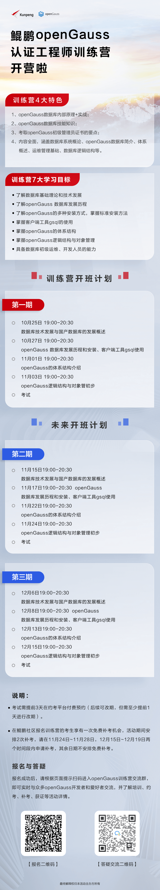

+++
title = "【限时激励】考openGauss认证，领京东卡"
time = "2022/11/01-2022/12/31"
date = "2022/11/01-2022/12/31"
tags = "会议"
label = "线下"
location = "线上"
img = "/zh/events/2022-10-28/banner.png"
img_mobile = '/zh/events/2022-10-28/banner.png'
link = "/zh/events/2022-10-28/Meetup.html"
author = "openGauss"
summary = ""

+++

考试日期

11月6日、11月13日、11月20日、11月27日；
12月4日、12月11日、12月18日、12月25日。
详情可以扫描上方答疑交流二维码入群交流。

关于OGCA, 点击下方链接：

https://opengauss.org/zh/training.html

**HCIA-openGauss认证**

HCIA-openGauss认证：

Huawei Certified ICT Associate-openGauss
培训和认证具备华为openGauss数据库开发和管理能力的工程师

关于HCIA-openGauss认证, 点击下方链接：

https://e.huawei.com/cn/talent/#/cert/product-details?certifiedProductId=503&authenticationLevel=CTYPE_CARE_HCIA&technicalField=PSC&version=1.0

**NCRE-openGauss数据库程序设计(全国计算机等级考试二级）**

NCRE-openGauss认证，点击下方链接：

https://ncre.neea.edu.cn/