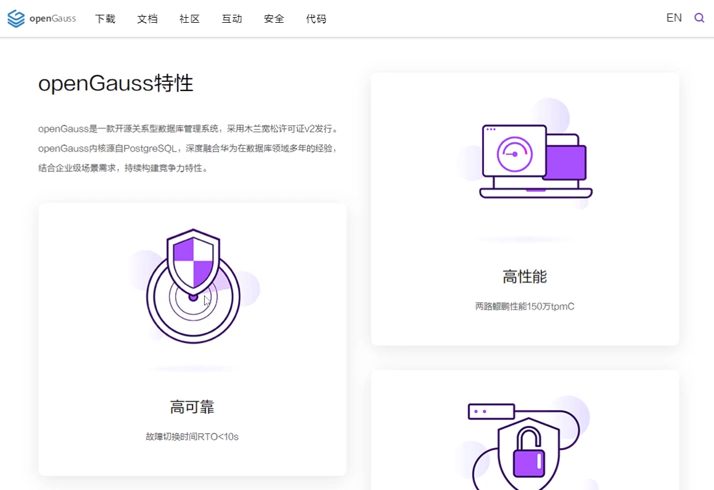

+++
title = "openGauss 1.1.0版本正式发布"
date = "2020-12-31"
tags = ["theme"]
banner = "/zh/news/2020-12-31/banner.png"
author = "openGauss"
summary = "openGauss 1.1.1版本正式发布"
+++

首先，openGauss社区祝大家元旦快乐！在2021年的第一天，openGauss1.1.0版本正式发布啦。openGauss1.1.0版本为Update版本，与原来的1.0.1版本特性功能保持兼容。同时，在此基础上增加了以下亮眼新特性：

LIST分区和HASH分区、DDL权限授权和回收、级联备机、字符数据类型长度兼容PG、自动索引推荐、plpython、备机备份、自治事务重构，并行查询重构、Interval分区、数据类型支持sysdate、支持增删备机节点、支持多版本python、在线添加索引、升级工具、安装与om工具解耦。

#### 新增特性

* 支持LIST分区和HASH分区

    列表分区（ListPartitioning）功能，即根据表的一列，将要插入表的记录中出现的键值分为若干个列表（这些列表在不同的分区里没有重叠），然后为每个列表创建一个分区，用来存储相应的数据；

    哈希分区（HashPartitioning）功能，即根据表的一列，通过内部哈希算法将要插入表的记录划分到对应的分区中。用户在CREATE TABLE时增加PARTITION参数，即表示针对此表应用数据分区功能。

* 双机HA增强

    支持级联备机，级联备机从备机上复制日志，减轻主机的业务处理压力。

* 备机个数扩展到8个。

    支持备机变为同步模式时间catchup2normal_wait_time参数可配置，备机启动与主机建立链接后，先处于日志追赶状态，等追赶的日志差距小于catchup2normal_wait_time，把备机变为同步模式。
    支持不同步配置文件，主备双机可能部署在不同规格的硬件上，主备的配置参数可能也不相同。修改原来的主备参数配置文件同步功能，支持不进行参数同步。

* 数据类型兼容扩展

    char和varchar支持对PG模式的兼容，在计算长度时，返回字符的长度，而不是字节的长度。

* 丰富监控维度

    get_instr_unique_sql()返回视图 增加sort&hash关于 work_mem 方面的信息监控。

    日志缓冲区wal_buffer监控，在get_instr_wait_event视图中添加WAIT_EVENT_WAL_BUFFER_ACCESS 和 WAIT_EVENT_WAL_BUFFER_FULL等待事件。其中WAIT_EVENT_WAL_BUFFER_ACCESS统计的是对wal buffer的访问次数（出于性能考虑，未统计访问耗时）；WAIT_EVENT_WAL_BUFFER_FULL统计的是对wal buffer满的访问次数和访问耗时统计。

* AI增强

    对于简单查询，根据SQL语句的访问条件，自动推荐合适的索引。

* 支持support plpython

    支持python语言为SQL编程语言。

* gs_basebackup支持备机备份

    gs_basebackup支持从备机上上备份数据，减轻主机的业务处理压力。

* 权限管理模型细化

    支持DDL权限Grant和Revoke；

* 自治事务重构

    原来的自治事务实现使用了进程间的通信方式，重构为线程间的通信方式，更简洁。

* 并行查询重构

    原来的并行查询和分布式版本的跨节点并行查询框架重复，现在重构为统一的并行框架。

* Interval分区

    在数据库插入表中的数据超过现有范围分区时，自动创建指定间隔的分区。

* 数据类型支持sysdate

    Sysdate返回当前日期时间，该时间为数据库所在宿主机的Linux操作系统时区时间。

* 支持增删备机节点

    提供om工具，支持对备机进行在线扩容和缩容，在不影响业务状态下动态的增删备机。

* 支持多版本python

    CentOS系统上，当前数据库安装需要依赖python3.6的版本。1.1.0发布的版本支持在python3.7下安装。也支持在指定的python3.*版本上自行编译三方库来适配更多的python版本。

* 在线添加索引

    通过create index concurrently语法，以不阻塞DML的方式在线创建索引。

* 升级工具支持

    提供升级工具，支持从1.0.1版本升级到1.1.0版本。

* 安装与OM工具解耦

    1.1.0版本将OM工具与数据库内核进行了解耦：

    工具单独划分了仓库openGauss-OM，后续OM工具代码使用该仓库进行管理。 
    具和内核分开打包，可以将两者镜像放到同一目录使用OM安装，安装方式保持不变。或者只关注内核则可以把内核镜像解压单独运行。

#### 看了这么多新特性，是不是很想动手一试呢？赶快来下载体验吧。

下载地址：<https://opengauss.org/zh/download.html>

除此之外，社区用户体验团队改版升级了openGauss官网，只为了让你有更好的体验。  

#### 这个星球很强大 | 趣味动效让你秒懂openGauss特性

为了突出如此强大的功能特性，社区用户体验团队在精简大篇幅文字的同时，还精心创作了一组视觉凝练、生动易懂的趣味hover动效，让你不仅在浏览网站过程中增添了无限乐趣，还可以轻松地把openGauss亮眼的四大核心特性牢记心中。

#### 这个星球很Fashion | 品牌插画让你在数据宇宙中翱翔

为了让你从进入openGauss社区网站的第一眼开始就沉浸在openGauss带来的数据世界中，体验团队结合使用场景创意定制了一系列时尚明快的艺术插画，通过数据几何体、星球开发者等元素精心营造了一个璀璨的数据宇宙，让浏览网站的你仿佛自由翱翔于奇幻数据空间中、在探索与追寻中共同壮大我们的数据空间。

#### 这个星球很友好 | 易用功能让你畅游网站

体验团队在网站改版优化的方方面面都时刻围绕着“以用户体验为中心”的核心设计理念，致力于让openGauss社区网站不仅仅“好看”，更重要的还是“好用”。这种设计理念体现在网站中各种细节中，比如下载页面曾经简单罗列着大段复杂的SHA256一致性检验码，不仅仅影响网站页面简洁美观、还给用户增添了需要手动选择复制的不便，而在新版openGauss下载页面中，长串的SHA256一致性检验码被极致简化成一个按钮，用户只需一个点击即可将SHA256码复制到粘贴板，既提升了用户的体验、又保证了页面的美观。

最后感谢大家在过去一年里对openGauss的关注和支持，特别是参与社区贡献的以下小伙伴们。

#### 贡献者列表（Gitee账号）

wanfang5, sqyyeah, lvmiao1229, zhang_xubo, zzzzzdb, scarbor_fair, liumin35, jia_junfeng1, chendong76, hongyehongye1, xiangxinyong, lee1002, wuyuechuan, cyw-0-ng, wanggzzs, huiu924, zhouxiongjia, zha_hw, anikikong, gongsiyi150, vastbase_yzhang, willemjiang, zhangxiaohai928, zhangzhijingMY, pan-jun, sun_xu_zong, wang-tq, y1309639, yansong_lee, emmajiang, li-jun056, liang_-123, liyang0608, llzx373, otis4631, totaj, xixicat, zhanglf-zkfr, chenxiaobin19, diagon-alley, gaojia629, gentle_hu, houjhibofa, jin_li, justbk, lys6676, xiezhipeng1, yidianjiujin, you-and-me, yunlongg, alienmoe, chenguojie, deadsec, dolphin-m, enbokang, gauss__gaoshi, giteegauss, grozazz, hillseas, hthinks, johnnyzhou, li_jianqiu, like11, nifinity, nwen_hw, pikeTWG, realzhouqingqing, reganhe_xx, struggle_hw, vinothv, weim-123, wustczx, xiong_xjun, yangyang374, ylfan96, yutang1, ywzq1161327784, zbxue, Adoube_548, RayH2020, barbedcc, bertliu, big_pig_123, bosihouzi, bowen9799, bzhaoop, catofpei, chen_chenn, chennaidong, chenzang, chunlei007, cylfsbm, dikk123, flytigerman, fss567, gwchengcheng, hemny, husan1024, initlove, jane_minjun, jcc123, jeffee, jerome-duomi, jie_lei, jimmyhujiming, jinyu_opengauss, jitao10, kamusis, karna, kivaking, lazpf, liangweii, lilexun, linxiaoxu131415, liushengxi, lizhenfeng123, ljiot, lmte3e4, luyao201, ma_xiaodi, matrix0xcc, nanmu2018, nonolili527, open__gs__2020, panchenbo, qq45068, romber, s36326, seulingfeng, stanleyren, sun_madman, templingfeng, tiantianxiangshang2020, tomas__junny, tonyhehe, toyato, trollzhao, wang_deng_yang, wangrui_rui, wei-haixu, weihan666, wenbling, wjmcat, wjzeng, wn952000, wotchin, xinmiaomiao, xue_meng_en, xzyinyong, yangkang52, yuzhenglin, yz_db, zhaorenhai, zhouzhishan, zilf, zju_hzd, zp123456, zumingjiang, zzcyd, I-am-a-robot, april01xxx, buter, chenlinfeng3, chinapenglin, code_wolf, cyqw, database_structure, ddwolf, dengxuyue, duoketang, duomibabi, ericwangpeng, gaiguoqiang12, gaoyunlong12, georgecao, gwp2464, gyt0221, hangjin2020, hljhnu, huangchengcheng1, huangzijian888, iloveuever, jiang_jianyu, jiangxiangbo, jixi_hexi, lesliexx, liheng188, lihongda12, linianA, lisa100, lishifu_db, liu_hui199828, liujunchigo, liuxu34, liyifeng-seu, looplocked, lqkitten, luo_zihao5524, luohongbins, lvhui123456, meimeidtt, minshengyunwei, mujinqiiang, opengauss_yanghaiyan, opgauss, pku__lisihao, plusvolcano, popastin, qin-wei, shaga, shenyuflying, shirley_zhengx, siven_dev, sl0915, sword-fairy-water-easy, tedlz123, thexiong7, tuohai666, victor-zhc, wang_pei_heng, wangdengke6, wangxinlian, wangzhijun2018, xiliu_h, xukunpeng, xzx666, yang558, yinzhishu, yuejiashen, yujiangaaa, yukai_k, zankyfun4, zerodefect, zhangshujie82, zhangyulong34, zheng_zelin, zhengyuhanghans, zhongjun2, zhu_jinwei

欢迎访问openGauss社区代码仓库提交Issue反馈你对新版本的建议。

openGauss组织仓库: <https://gitee.com/opengauss>

openGauss镜像仓库: <https://github.com/opengauss-mirror>